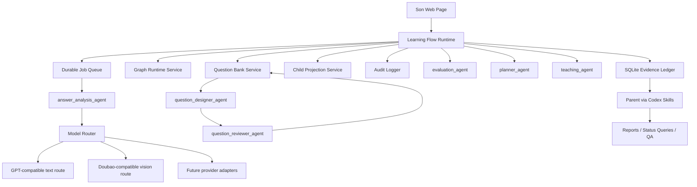
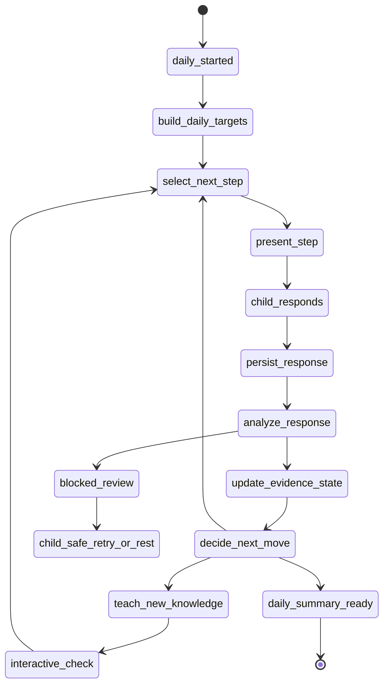

# AI Native Learning System Architecture v3

Status: final baseline after architecture convergence
Owner: 若命, with review responsibilities from 镜花 / 霜弦 / 观止
Created: 2026-07-10 CST
Scope: single-child AI-native math learning system, summer bridge from primary gaps to Grade 7 preview
Review status: architecture/data/QA review incorporated
Product baseline: `docs/product/ai_native_math_learning_prd_v3.md`
Runtime contract: `docs/architecture/daily_learning_runtime_contract_v1.md`

## 0. Version Meaning

This document is the v3 architecture baseline. It does not merely describe the
current code. It defines the target system contract that the next implementation,
review, and QA work must converge to.

v2 proved that a runnable pipeline is not enough. The system must be stable as a
teaching process, not just as a web app:

- The child uses one Web surface only.
- The parent uses Codex only, not a parent dashboard.
- The system must complete a normal daily learning flow without parent
  intervention.
- Agents provide professional judgments, but deterministic runtime code owns
  execution, queueing, state, recovery, and safety gates.
- Every teaching, diagnosis, question, attempt, evaluation, plan, and report
  must bind to the math knowledge graph.
- Questions must be high-signal Grade 7 bridge questions, not low-age arithmetic
  drills with decorative process language.
- Answer analysis must judge answer, method, reasoning, process, and alternative
  valid approaches. It must not be string matching.
- Planner and Teaching must decide whether to reteach, retest, rollback,
  consolidate, or stretch based on evidence.

Review baseline:

- 镜花 gate: runtime, evidence lineage, child-safe boundary, adapter isolation,
  restart/retry, and fail-closed behavior must be explicit.
- 霜弦 gate: graph version, question active-use, data provenance,
  answer-analysis semantics, and report evidence scope must be explicit.
- 观止 gate: real child path, 10-20 adaptive daily questions, async review,
  semantic judging,
  and anti-false-pass checks must be explicit.

## 1. Product Boundary

### 1.1 Users

| User | Interface | What this user does | What this user does not do |
|---|---|---|---|
| Son | Child Web page | Learn, answer, upload photos, read feedback, continue to the next learning step | See graph ids, model names, internal agent names, rubrics, queue details, parent operations |
| Parent | Codex | Ask progress, inspect learning evidence, discuss system direction, request product or architecture changes | Manually grade normal answers, copy results between systems, operate a parent dashboard |

There is no parent Web端 in this architecture. Parent-facing visibility is a
Codex/operator capability backed by persisted DB rows and reports.

### 1.2 Internal Roles

Internal teaching agents are system components. They are not 若命、听云、观止、
镜花、霜弦. Those names belong to project collaboration, review, and delivery
work around the system.

The system's mainline teaching agents are:

- `question_designer_agent`
- `question_reviewer_agent`
- `answer_analysis_agent`
- `evaluation_agent`
- `planner_agent`
- `teaching_agent`

Low-frequency or paused agents:

- `self_evolution_agent`: paused as an automatic mutator. It may archive
  evidence and propose improvements, but it cannot automatically change active
  question bank, graph, mastery status, or next plan.
- `graph_evolution_agent`: low-frequency graph maintenance only, never daily
  mainline flow.

Removed from daily mainline:

- `session_orchestrator_agent`: replaced by deterministic Learning Flow Runtime.
- Daily `graph_agent`: replaced by deterministic Graph Runtime Service.

Normal learning must not require the parent to copy content into Codex, press a
hidden operator button, manually grade an answer, or manually close a session.

## 2. Architecture Thesis

The core split is:

```text
Runtime guarantees execution.
Agents produce expert judgments.
Services provide deterministic domain operations.
Skills let Codex inspect, maintain, test, and improve the system.
```

### 2.1 Boundary Definitions

| Type | Definition | Examples | Can affect child learning? |
|---|---|---|---|
| Agent | Internal intelligent role invoked by the learning system. It returns structured judgments or content under a contract. | Answer Analysis, Evaluation, Planner, Teaching | Yes, only through runtime gates |
| Runtime | Deterministic state machine and execution framework. It controls queueing, transitions, recovery, idempotency, and fail-closed behavior. | Learning Flow Runtime | Yes, it is authoritative for state |
| Service | Deterministic domain module used by runtime and agents. | Graph Runtime Service, Question Bank Service, Model Router | Yes, through explicit APIs |
| Skill | Codex-side external capability for parent/operator query, development, review, QA, or maintenance. | daily report skill, graph maintenance skill, live UI QA skill | No direct child mainline control |

An agent is never "just a prompt". Every production agent is:

```text
Agent = Prompt + Knowledge Pack + Contract + Hard Gate + Test Oracle
```

## 3. System Map



## 4. Deterministic Runtime

### 4.1 Runtime Responsibility

Learning Flow Runtime owns:

- session state machine
- child submission persistence
- async review queue
- idempotent background job execution
- restart recovery
- closure gating
- evidence package construction
- agent invocation order
- structured output validation
- stale and invalid evidence exclusion
- child-safe projection
- audit rows and reportability

Agents may recommend or judge. They do not directly move the session state.

Runtime must fail closed. If required evidence is absent, stale, malformed,
low-confidence, or invalidated, runtime waits, retries, blocks with an
operator-visible reason, or asks the child for observable evidence. It must not
invent correctness, mastery, weakness, or next tasks.

### 4.2 Main State Machine



### 4.3 Required Transitions

| Runtime node | Required inputs | Producer | Hard gate | Side effect | Next |
|---|---|---|---|---|---|
| `daily_started` | child identity, date, active learning goal | runtime | one active daily flow | daily session row | `build_daily_targets` |
| `build_daily_targets` | graph status, due review, new-learning path | planner/graph service | mastered nodes skipped unless spaced confirmation is due | target queue, not fixed question list | `select_next_step` |
| `select_next_step` | latest evidence, target queue, question bank metadata | planner/question bank | choose one next step only; active eligible item or teaching step | current step row | `present_step` |
| `present_step` | current step projection | runtime | child-safe projection only | child page renders one step | `child_responds` |
| `child_responds` | task position/current step handle, answer text/photo/interaction | child API | no raw ids from child, non-empty evidence when required | response/attempt row, attachment row | `persist_response` |
| `persist_response` | response/attempt id | runtime | no duplicate active attempt for same step | durable evidence row | `analyze_response` |
| `analyze_response` | attempt or interaction evidence | answer analysis/teaching check | structured output valid, graph-bound, confidence policy passed | answer analysis or check analysis | `update_evidence_state` |
| `update_evidence_state` | current valid analysis | evaluation agent/runtime | no pending/error/missing-analysis evidence | mastery decision or provisional state | `decide_next_move` |
| `decide_next_move` | daily target state, mastery, graph, bank metadata | planner agent | no stale or unapproved question | next move decision | next step / teaching / summary |
| `teach_new_knowledge` | selected graph node, teaching contract | teaching agent | child-safe, graph-bound, micro-check included | teaching package | `interactive_check` |
| `daily_summary_ready` | today's valid steps and remaining state | runtime/report service | evidence labels explicit | child summary and Codex-reportable facts | complete |

The authoritative close path is:

```text
daily targets
-> current step
-> child response
-> answer_analysis or interaction-check package
-> graph binding package
-> evaluation update
-> planner next-step decision
-> optional teaching package
-> next current step or daily summary
```

If the package needed for the next decision is missing, that branch is not
complete. Runtime may either wait/retry, ask for clearer evidence, or choose an
independent safe step whose decision does not depend on the pending evidence.

### 4.4 Async And Next-Step Rule

Child response persistence must be fast:

1. Save answer and photo.
2. Enqueue or run the required analysis.
3. Show a child-safe transition state.

Next-step selection is adaptive:

- If the next decision depends on this answer, runtime waits for the analysis
  result within a short child-safe transition.
- If the model is slow but there is an independent safe step, runtime may choose
  that step without using the pending answer.
- If the answer is photo-only, unclear, or low-confidence, runtime asks for
  clarification or chooses an independent step; it must not infer mastery.
- The system must never commit a full daily question list up front and then call
  it adaptive.

If AI configuration is missing, the system must not pretend it is "still
grading". It must persist a clear operator-visible failure and show a child-safe
message such as "这次批阅没有启动成功，系统会稍后重试". The planner must not use
that attempt as graded evidence.

Daily feedback must cover the whole valid daily flow. Showing only the last
submitted question's analysis after a 10-20 question day is a product failure.

### 4.5 Recovery Rule

On server start, child bootstrap, or operator bootstrap, runtime must scan:

- queued jobs
- stale running jobs
- pending attempts with no live job
- completed model outputs not applied to attempts
- sessions waiting on closure

Recovery must be idempotent. Repeated polling or repeated close requests must
not double-grade attempts, duplicate plans, or create duplicate evolved
questions.

Required idempotency and recovery keys:

- one active daily flow per child/date unless explicitly resumed
- one current step at a time on the child surface
- one active attempt/interaction response per current step
- one active review job per attempt
- one applied answer analysis per attempt version
- one evaluation update per valid evidence package
- one planner next-step decision per latest evidence state
- one child projection per current flow state

## 5. Model Router

### 5.1 Purpose

All model calls go through `model_router`. No agent calls a provider directly.

The router owns:

- provider alias resolution
- model capability matrix
- structured JSON strategy
- fallback to plain JSON extraction when a model does not support
  `response_format.type=json_schema`
- retries and timeouts
- route metadata
- no-secret audit records

### 5.2 Default Routing

| Use case | Default model family | Notes |
|---|---|---|
| Answer analysis, evaluation, planning, teaching, question design/review | GPT-compatible text route | Use strongest available model first. |
| Photo answer transcription / math object extraction | Doubao vision-capable route | OCR is evidence, not ground truth. |
| DeepSeek or future text models | Adapter only | Must not assume OpenAI schema features. |

API keys must never be written into docs, DB rows, reports, screenshots, or
agent audit output.

## 6. Evidence Ledger

SQLite remains the local evidence ledger for the current phase. It is sufficient
for one child and local operation, provided the runtime treats it as an audit
ledger, not a scratch pad.

### 6.1 Source Evidence Is Append / Version / Invalidate

Allowed:

- create attempt rows
- create attachment rows
- create background job rows
- create agent run rows
- create mastery decision rows
- version question rows
- invalidate wrong or contaminated evidence

Forbidden in normal operation:

- silently deleting real attempts
- overwriting child answers
- treating old graph interpretations as current truth
- using invalidated evidence in reports, plans, mastery, or generated questions

Every material artifact must carry enough provenance to be audited:

| Artifact | Required provenance |
|---|---|
| Question | `graph_node_id`, `graph_version`, source type, item version, review record |
| Attempt | session, task position, question, node, evidence status, submitted source |
| OCR output | attachment, OCR route, transcript, math objects, confidence |
| Answer analysis | attempt, agent key, model route, prompt/schema version, confidence |
| Mastery decision | node, evidence attempt ids, graph version, evaluation run |
| Plan | source mastery decisions, selected question ids, graph nodes, bank version |
| Teaching package | diagnosis source, target node, teaching move, micro-check evidence |
| Report claim | session, attempt, node, model, plan source or explicit pending/stale label |

### 6.2 Usable Attempt Predicate

An attempt can drive evaluation/planning only if all conditions hold:

```text
attempt.evidence_status == active
attempt.grading_status == graded
attempt.answer_analysis_json is present and schema-valid
attempt.question_id points to a current active eligible question
attempt.node_id is a known graph node
attempt.model/output confidence policy passed
attempt is not stale under current graph/question version rules
```

Pending, invalidated, stale, malformed, mock-only, or missing-analysis evidence
must fail closed.

Reports must label evidence as one of:

- `confirmed`
- `pending`
- `blocked`
- `inferred`
- `stale`
- `mock_only`
- `missing_lineage`

Codex may summarize reports, but Codex conversation text is not source evidence.

### 6.3 Learner Node Status Ownership

`learner_node_status` is owned by `evaluation_agent` through runtime gates.

Status is derived, not manually true:

- `A`: stable mastery across repeated valid evidence and transfer.
- `B`: usable but needs confirmation.
- `C`: unstable, needs repair or retest.
- `D`: blocked, needs rollback or reteaching.

One correct answer cannot produce `A`. A right final answer with missing or
wrong reasoning cannot be treated as mastery.

Future schema should add field-level provenance such as:

- `mastery_decision_id`
- `agent_run_id`
- source attempt ids
- graph version
- question bank version

## 7. Knowledge Graph

### 7.1 Runtime Use

Daily graph operations belong to Graph Runtime Service, not a free-form graph
agent.

Graph Runtime Service provides:

- node lookup
- prerequisite chain lookup
- unlock path lookup
- rollback candidate selection
- graph binding validation
- graph version/hash
- graph-bound report labels

Every teaching/evidence artifact should include both `graph_node_id` and
`graph_version`. If graph structure changes, old attempts and generated
questions must be checked for stale interpretation before reuse.

### 7.2 Graph Evolution

Graph evolution is low-frequency and controlled. It may be proposed when real
learning evidence shows:

- missing prerequisite relation
- node too coarse
- node too narrow
- unclear teaching contract
- repeated planning ambiguity

It must not silently reinterpret old evidence. Any graph change requires a
migration or compatibility note for existing attempts and question lineage.

## 8. Question Bank

### 8.1 Principle

The question bank is not a pile of fixed exercises. It is a graph-bound evidence
instrument.

Each node needs enough high-quality active question capacity to:

- diagnose conceptual understanding
- expose model/relation errors
- test procedural stability
- require expression and checking
- distinguish calculation slips from misunderstanding
- support same-structure retest
- support near-transfer retest
- support controlled stretch

The practical target is at least 20 active high-quality question slots per
knowledge node. These are not 20 permanent rows. They are current, reviewer
approved, non-duplicative, evidence-bearing slots that may be refreshed or
generated.

### 8.2 Difficulty Definition

Difficulty is not large numbers.

Difficulty is defined by:

- concept load
- abstraction level of the model
- step-chain length
- representation transfer
- transfer distance from examples
- distractor strength
- need for explanation/proof/check
- prerequisite load
- risk of common wrong model
- need to compare methods

### 8.3 Difficulty Levels

| Level | Name | Meaning | Use for incoming Grade 7 |
|---|---|---|---|
| L1 | 基础确认 | confirms prerequisite fact or one-step rule | Only after evidence shows a narrow repair need |
| L2 | 标准应用 | standard model use with visible process | Small portion |
| L3 | 变式诊断 | detects misunderstanding under a changed surface | Main portion |
| L4 | 迁移解释 | requires representation, explanation, or method comparison | Important portion |
| L5 | 受控拔高 | controlled competition-style or high-transfer probe | Limited, never mainline |

### 8.4 Required Question Fields

A schedulable question must carry these fields. The planner cannot select
professionally without them.

| Field group | Required fields |
|---|---|
| Identity | `question_id`, `item_version`, `source_type`, `created_by`, `review_record_id` |
| Graph binding | `node_id`, `prerequisite_node_ids`, `unlocks_node_ids`, `graph_version` |
| Learning purpose | `evidence_goal`, `teaching_phase`, `target_mastery_level`, `target_dimensions` |
| Difficulty | `difficulty_level`, `difficulty_vector`, `stretch_type`, `age_floor_reason` |
| Question family | `question_family`, `variant_signature`, `surface_context`, `representation_type` |
| Prompt | `child_prompt`, `answer_format`, `requires_photo_allowed`, `child_safe_language_checked` |
| Reasoning demand | `requires_model`, `requires_steps`, `requires_explanation`, `requires_check`, `requires_counterexample_or_comparison` |
| Rubric | `rubric_dimensions`, `max_points`, `minimum_reasoning_evidence`, `partial_credit_rules` |
| Solution evidence | `reference_answer`, `valid_solution_paths`, `common_wrong_paths`, `wrong_reason_right_answer_cases` |
| Error mapping | `target_error_tags`, `failure_modes`, `rollback_candidates`, `retest_policy` |
| Scheduling | `active_eligible`, `cooldown_policy`, `max_repeat_per_family`, `same_structure_group`, `near_transfer_group` |
| Audit | `source_lineage`, `reviewer_verdict`, `rejection_reasons`, `model_prompt_version`, `human_notes` |

The active bank count for a node counts only current, reviewer-approved,
distinct, graph-bound, high-signal slots. Historical rows, rejected drafts,
duplicates, stale versions, and metadata-only approvals do not count.

### 8.5 Active-Use Gate

Only `question_reviewer_agent` plus hard runtime validation can approve active
use.

The gate rejects:

- graph-unbound questions
- low-age mechanical arithmetic unless recent evidence justifies repair
- answer-only questions
- fake process wrappers around trivial work
- prompts that cannot expose reasoning
- missing rubric or valid solution paths
- missing common wrong-path analysis
- child-facing backend/meta/model language
- copied or unauthorized external content
- duplicate stems or variants that create mechanical cycling
- stale question versions
- missing durable review record
- metadata-only approval without recomputed reviewer verdict
- sample/mock/generated content presented as production bank quality

Rejected candidates go to `rejected_drafts` and may inform future rule
improvement. They never reach the child.

## 9. Agent Knowledge Pack Standard

Each production agent must load a Knowledge Pack. A prompt alone is not enough.

Standard files:

```text
agent_knowledge_packs/{agent_key}/
  role_boundary.md
  knowledge_base.md
  rules.json
  examples.json
  anti_examples.json
  output_contract.json
  test_oracle.md
  evolution_policy.md
```

| File | Purpose |
|---|---|
| `role_boundary.md` | What this agent owns, what it must not do, handoff rules |
| `knowledge_base.md` | Domain knowledge, grading principles, teaching heuristics, difficulty definitions |
| `rules.json` | Machine-checkable hard rules and thresholds |
| `examples.json` | Good outputs with explanation of why they pass |
| `anti_examples.json` | Bad outputs and rejection reasons |
| `output_contract.json` | Strict schema and required fields |
| `test_oracle.md` | Cases used by QA to judge the agent |
| `evolution_policy.md` | What evidence may update this pack, and what requires human/Codex approval |

Runtime must record pack version and output contract version in agent audit rows.

## 10. Mainline Agents

### 10.1 `question_designer_agent`

Role:

Design evidence-bearing question candidates for a graph node and learning
purpose.

It does:

- choose evidence goal
- choose difficulty vector
- design question family and variant
- define expected reasoning evidence
- define rubric and valid solution paths
- define likely wrong paths
- map wrong paths to graph/prerequisite candidates
- produce a candidate package

It does not:

- approve active use
- chase quantity
- generate low-level drills to fill quotas
- copy private or commercial questions
- decide learner mastery

Output:

`question_candidate_package`, not an active question.

Candidate package must include enough material for the reviewer and future
answer-analysis oracle to work: rubric, valid solution paths, common wrong
paths, expected observable evidence, difficulty vector, and rollback candidates.

### 10.2 `question_reviewer_agent`

Role:

Act as active-use gate for question candidates.

It does:

- recompute graph binding
- inspect difficulty against Grade 7 bridge standard
- reject answer-only or low-signal prompts
- inspect reasoning observability
- inspect rubric sufficiency
- inspect duplicate and variant quality
- inspect child-facing wording
- create durable approval or rejection record

It does not:

- rewrite weak questions into active questions without a new candidate package
- approve by trusting candidate metadata
- optimize for bank size

Output:

`question_review_record` with `active_eligible=true/false`.

Approval must be durable and recomputable. Trusting the designer's own
`active_eligible` claim is forbidden.

### 10.3 `answer_analysis_agent`

Role:

Analyze one child attempt as evidence.

It does:

- read typed answer and photo/OCR evidence
- judge final answer
- judge model or relation
- judge steps
- judge symbols and units
- judge check or explanation
- identify valid alternative methods
- detect wrong-reason-right-answer cases
- distinguish calculation slip from conceptual/model error when evidence allows
- produce process gap and child-facing next prompt

It does not:

- update mastery
- choose next question
- do string matching as final judgment
- invent evidence from low-confidence OCR
- silently default to correct or wrong after malformed model output

Required output dimensions:

- `final_answer`
- `model_or_relation`
- `steps`
- `symbols_units`
- `check_or_explanation`
- `alternative_validity`
- `process_gap`
- `error_tags`
- `blocking_evidence`
- `confidence`
- `child_feedback_seed`

If photo evidence is present, output must separately state OCR status,
transcript/math-object confidence, and whether OCR evidence is usable.

### 10.4 `evaluation_agent`

Role:

Derive graph-node mastery from multiple valid evidence items.

It does:

- consume current valid answer analyses
- classify mastery as A/B/C/D
- distinguish concept, model, procedure, calculation, expression, transfer
- decide whether evidence is enough or needs confirmation
- write mastery decision and status through runtime

It does not:

- treat one correct answer as mastery
- use pending, invalidated, stale, malformed, or mock-only evidence
- directly choose the next question
- label vague "careless" as a cause without evidence

### 10.5 `planner_agent`

Role:

Teaching decision engine. It decides what learning move should happen next and
which question-bank slots can provide the needed evidence.

It does:

- classify the learning situation
- choose teaching move
- choose daily arc
- select question slots from a small pre-filtered candidate packet using
  metadata and graph prerequisites
- decide when to same-structure retest
- decide when to near-transfer retest
- decide when to rollback
- decide when to stretch
- set stop conditions

It does not:

- mechanically map A/B/C/D to next tasks
- blindly drill same type after wrong answer
- ask for abstract "near transfer" without knowing bank metadata
- use unapproved or stale questions
- receive or search the full question bank in the hot path

Learning situation taxonomy:

| Situation | Meaning | Typical move |
|---|---|---|
| `blocked` | cannot start or prerequisite missing | rollback reteach, prerequisite probe |
| `concept_confusion` | object/rule meaning wrong | essence reteach, contrast cases |
| `model_relation_error` | relation or equation/model setup wrong | worked example, model repair |
| `procedure_unstable` | model right, execution chain unstable | faded scaffold, same-structure retest |
| `calculation_symbol_slip` | local slip with otherwise sound reasoning | targeted micro repair, quick confirmation |
| `expression_insufficient` | answer may be right but process not observable | explanation retest, expression modeling |
| `near_transfer_failed` | standard task works, changed representation fails | near-transfer reteach and retest |
| `recovering` | recent repair showing promise | confirmation arc |
| `stable` | repeated evidence sound | advance |
| `stretch_ready` | stable with capacity for challenge | controlled stretch |

Teaching moves:

- `micro_reteach`
- `worked_example`
- `contrast_cases`
- `error_diagnosis`
- `faded_scaffold`
- `same_structure_retest`
- `near_transfer_retest`
- `prerequisite_probe`
- `rollback_reteach`
- `stretch_transfer`

Daily arc examples:

| Arc | When used | Step-by-step shape |
|---|---|---|
| `diagnostic_arc` | unknown state | anchor, prerequisite probe, standard, variant, explanation, mixed discriminator, transfer, stretch-lite, exit checks |
| `model_repair_arc` | relation/model confusion | contrast, worked example, scaffold, same-structure retest, near-transfer, expression check, mixed discriminator, exit |
| `procedure_stability_arc` | model sound but execution unstable | short repair, scaffold, independent standard, variants, symbol/unit check, same-structure confirmation, exit |
| `transfer_arc` | standard okay, transfer weak | representation bridge, near-transfer, changed context, comparison, controlled stretch, exit |
| `advance_arc` | stable | preview new node, standard examples, variants, mixed checks, stretch |

In v3, these arcs are templates for step-by-step selection, not fixed question
lists. The planner keeps the daily target and chooses the next visible step only
after reading the latest evidence state.

Performance boundary:

- deterministic services pre-filter the question bank
- planner receives only a compact candidate packet, normally 5-8 question
  metadata rows for the current target
- model calls record context size, latency, timeout, and fallback mode
- if planner times out, runtime may choose a conservative safe fallback but must
  not invent mastery or teaching conclusions

Branch policy:

- Correct with sound reasoning: confirm or advance.
- Correct answer only: require explanation/process evidence before mastery.
- Correct final answer with wrong reasoning: repair the wrong model, not mark mastery.
- Wrong final answer with valid model: repair procedure, symbol, or calculation.
- Wrong model: rollback, contrast, or reteach.
- Stuck: micro-teach, prerequisite probe, then a smaller evidence task.

### 10.6 `teaching_agent`

Role:

Cognitive repairer, not answer explainer.

It turns diagnosis evidence into minimal, precise, verifiable teaching.

Two modes:

- wrong attempt explanation
- knowledge point teaching

Wrong attempt explanation must:

1. preserve what the child did right
2. find the first cognitive break
3. explain why that break matters
4. contrast child thought with a better thought
5. repair the smallest necessary point
6. give a micro task that reveals whether repair worked

Knowledge point teaching must:

1. explain why this knowledge exists
2. identify the core object
3. build the core model
4. derive the rule from the model
5. show positive and negative examples
6. walk through one standard example
7. show variation boundary
8. ask a micro check

Allowed teaching moves:

- essence reteach
- contrast discrimination
- counterexample break
- step skeleton
- faded scaffold
- analogy or transfer
- expression modeling
- check-back

Teaching package fields:

- `teaching_target`
- `learner_state`
- `explanation_move`
- `child_explanation`
- `contrast.child_thought`
- `contrast.better_thought`
- `micro_check.prompt`
- `micro_check.expected_evidence`
- `hint_ladder`
- `stop_condition`

It must not:

- output backend labels
- give a long lecture
- solve every next step for the child
- shame the child with low-level tasks
- hide uncertainty when evidence is insufficient

## 11. Learning Modes

The son's normal day has two ordered parts:

```text
old-knowledge review -> new-knowledge learning
```

Old-knowledge review comes first because the system must know whether required
prerequisites are stable enough for the next graph node. New knowledge begins
only when the relevant prerequisite chain is sufficiently clear, or when the
planner intentionally chooses a small prerequisite repair before teaching.

### 11.1 Mode A: Daily Review Flow

Child flow:

1. Open child page.
2. Start old-knowledge review.
3. See only the current question or interaction, not a full fixed paper.
4. Submit answer or photo.
5. The system analyzes this step and chooses the next step from the graph.
6. Continue until the daily review budget is satisfied or the system has enough
   evidence to move on.
7. Read a short summary of today's confirmed points, weak points, and next move.

The daily review budget is normally 10-20 questions/interactions. This is a
budget, not a fixed list. The system must not force mastered graph nodes into
the day just to fill quantity.

Review candidate priority:

| Priority | Source | Meaning |
|---|---|---|
| P0 | blocked/unpassed graph nodes | `D` or repeated `C` evidence; must repair or rollback |
| P1 | prerequisite nodes for upcoming new learning | not enough evidence to safely learn the next node |
| P2 | untested graph nodes in current path | no valid evidence yet |
| P3 | weak but recovering nodes | `B/C` nodes needing same-structure or near-transfer confirmation |
| P4 | new-learning verification nodes | checks after a new concept was taught |
| P5 | mastered nodes due for spaced confirmation | only light sampling; otherwise skip |

Mastered nodes are skipped unless a spaced-confirmation policy says a tiny check
is due. Skipping is a positive system decision, not missing coverage.

Next-step selection policy:

```text
1. Read latest usable evidence.
2. Recompute only affected graph-node states.
3. If the current node is blocked, select prerequisite repair or micro-teaching.
4. If the current node is weak but repairable, select same-structure or
   near-transfer confirmation.
5. If old-knowledge review still has high-priority unmet targets, select the
   next review step.
6. If prerequisites for the next new node are stable, enter new-knowledge
   teaching.
7. If new knowledge was just taught, select an interaction or verification
   question before moving on.
8. If today's evidence budget is enough, produce daily summary.
```

Skip policy:

| Node state | Default action |
|---|---|
| `A` stable and not due | skip |
| `A` due for spaced check | one lightweight confirmation only |
| `B` usable but unconfirmed | confirmation or near-transfer check |
| `C` unstable | repair, reteach, or retest |
| `D` blocked | rollback to prerequisite or micro-teach |
| untested | diagnostic step before relying on it |

The planner must explain each selected next step with:

- source node
- reason for selecting this node now
- why mastered alternatives were skipped
- expected evidence from the next step
- branch to take after correct, partial, wrong, stuck, answer-only, or pending
  evidence

System flow:

1. Planner builds today's target set from graph status.
2. Runtime asks Planner for exactly one next step.
3. Question Bank Service returns an active eligible question or Teaching Agent
   returns an interaction/micro-check.
4. Child responds.
5. Answer Analysis or Teaching Check analyzes the response.
6. Evaluation updates only the affected graph-node state.
7. Planner decides the next step: same-structure retest, prerequisite rollback,
   explanation, near-transfer, new node, stretch, or daily summary.

### 11.2 Mode B: Learn New Knowledge Point

Child flow:

1. The system selects the next learnable graph node.
2. The child receives a short explanation built from the node's teaching
   contract.
3. The child answers an interaction or micro-check.
4. The system reacts to that answer before continuing.
5. The child then does standard, variant, and transfer questions as needed.
6. Review happens after each meaningful step, not only at the end.
7. The system either confirms understanding, repairs a gap, rolls back to a
   prerequisite, or moves to a controlled stretch.

New-knowledge entry gate:

```text
candidate node is on the planned graph path
and prerequisite chain has no active D state
and any C prerequisite has a repair/confirmation plan
and there is enough recent evidence to avoid teaching over a hidden gap
```

New knowledge is not a video-like lecture. It is an interactive graph-node
learning loop:

```text
essence explanation
-> core model
-> rule derived from model
-> quick interaction
-> standard question
-> variant question
-> review/repair
-> near-transfer or stop
```

If the quick interaction fails, the system does not continue to more practice
as if teaching succeeded. It switches to contrast, micro-reteach, or prerequisite
probe.

System flow:

1. Graph service selects the next node whose prerequisites are sufficiently
   stable.
2. Teaching Agent produces the concept teaching package:
   essence, core model, rule derivation, examples, variation boundary, and
   micro-check.
3. Runtime presents one teaching or interaction step.
4. Teaching Check / Answer Analysis evaluates the response.
5. Evaluation updates node state conservatively.
6. Planner chooses the next step:
   reteach, contrast case, worked example, standard question, variant,
   near-transfer, rollback, or stretch.

## 12. Self-Evolution Policy

Self-evolution is paused as a mainline automatic changer.

Current allowed role:

- collect evidence
- identify repeated failure patterns
- propose improvements to question families, rubrics, prompts, or agent packs
- write proposal records for Codex/operator review

Current forbidden role:

- automatically alter active question bank
- automatically alter graph structure
- automatically alter learner mastery
- automatically alter next plan
- create fake "evolution" for tests

Future self-evolution can be reopened only after the main runtime, agents,
question bank, and QA are stable.

## 13. Codex Skills

Skills are external operator capabilities. They help Codex see and maintain the
system. They are not child-facing product features.

Recommended skill roadmap:

| Skill | Purpose |
|---|---|
| `learning-system-status` | Query DB and reports for current progress, blockers, pending jobs, next plan |
| `learning-daily-report` | Generate and summarize daily learning report |
| `question-bank-review` | Audit active-use bank by node, difficulty, duplicate, rubric, reasoning demand |
| `agent-knowledge-pack-maintenance` | Inspect and update agent packs under review gates |
| `live-child-ui-qa` | Run browser-based child-path tests and screenshots |
| `graph-maintenance` | Validate graph refs, prerequisites, lineage, graph version effects |
| `model-config-check` | Verify model routes and structured output compatibility without exposing secrets |

## 14. Child-Safe Projection

The child page receives only:

- task position
- child-facing topic label
- prompt
- answer input mode
- optional hint or support
- save status
- review-ready status
- child-facing feedback
- next child action

The child page must not receive:

- raw question ids
- attempt ids
- session ids
- graph ids
- agent names
- provider/model names
- rubrics
- OCR confidence
- backend stage labels
- parent/Codex instructions
- "copy this to Codex" style language

Normal child progress must never require parent intervention.

## 15. QA Strategy

### 15.1 QA Must Prove Four Integrities

| Integrity | What must be checked |
|---|---|
| Chain integrity | UI/API/DB/background jobs reach expected states |
| Semantic integrity | answer analysis, tags, process gaps, scores, OCR, cause analysis, status are correct |
| Teaching integrity | questions and next plans are graph-bound, age-appropriate, diagnostic, non-mechanical |
| Provider integrity | mocked tests and live-model tests are reported separately |

### 15.2 Required Child Scenarios

Full QA for the child flow must cover:

- correct answer with sound reasoning
- answer-only submission
- stuck or cannot start
- blank or unusable evidence
- correct final answer with wrong reasoning
- partially correct relation with wrong final answer
- symbol or unit issue
- readable photo answer
- unclear photo answer
- weak evidence driving reteach
- weak evidence driving prerequisite probe
- weak evidence driving same-structure retest
- weak evidence driving near-transfer retest
- all-correct daily review segment that advances without fabricating weakness
- model route disabled or misconfigured
- server restart with queued/running jobs
- repeated polling and duplicate submit attempts
- old 4-question flow or stale `latest` report pretending to be current PASS

### 15.3 Anti-False-Pass Rule

A QA pass is invalid if:

- exit code says pass but issue count says fail
- report verdict disagrees with DB facts
- browser flow passes but no model/semantic evidence was checked
- mocked model evidence is described as live model quality
- only the last question's analysis is shown after a 10-20 adaptive day
- child is left waiting with no operator-visible reason
- next plan cannot be traced back to attempts, node status, graph, and question metadata

Every full QA report must record:

- base URL
- DB path
- provider mode: mock, recorded, or live
- code timestamp or version marker
- session ids / sampled attempt ids
- screenshot or browser artifact path
- report path
- whether it wrote to the real ledger or an isolated test ledger

For full PASS, QA must provide at least two independent evidence types, for
example:

- integration test output plus DB facts
- API response samples plus code-path proof
- browser screenshots plus matching DB/API facts
- live provider samples plus stored agent-run audit rows

Mock-only QA can at most be `QA_PASS_WITH_SCOPE` when the claim involves model
intelligence.

## 16. Review Responsibilities

| Reviewer | Must check |
|---|---|
| 镜花 | runtime state machine, async recovery, idempotency, model adapter isolation, child-safe API, evidence lifecycle, review gates |
| 霜弦 | graph binding, question quality, active-use gate, rubric/oracle quality, answer-analysis evidence, report truth labels |
| 观止 | real child path, browser operation, semantic cases, async/wait cases, no false pass, next-plan correctness |

For high-risk work, `PASS_WITH_SCOPE` is acceptable only when the scope is
clearly labeled. It must not be presented as full live-system proof.

## 17. Implementation Queue

Priority order:

1. Finalize this v3 architecture as the source of truth.
2. Define agent knowledge pack directory structure and schemas.
3. Implement Learning Flow Runtime skeleton with explicit states, gates,
   idempotency, recovery, and child-safe projection.
4. Implement or refactor Model Router compatibility matrix:
   GPT default, Doubao vision, DeepSeek/future plain JSON fallback.
5. Move question standards, difficulty rules, forbidden patterns, rubrics, and
   examples out of Python-only code into reviewable data files.
6. Upgrade `question_designer_agent` and `question_reviewer_agent` around
   Knowledge Packs and active-use gate.
7. Upgrade `answer_analysis_agent` contract so its output fully supports
   evaluation, planning, and teaching.
8. Upgrade `evaluation_agent` to own mastery decisions with strict evidence
   predicates and provenance.
9. Upgrade `planner_agent` as a teaching decision engine using bank metadata,
   graph prerequisites, learning situation taxonomy, daily arcs, and stop
   conditions.
10. Upgrade `teaching_agent` as cognitive repairer for wrong attempts and new
    knowledge teaching.
11. Downgrade `self_evolution_agent` to evidence archive and proposal-only mode.
12. Build Codex skills for status, daily report, bank review, graph maintenance,
    model config check, and live child UI QA.
13. Rewrite QA cases from the son's real-use perspective, including 10-20
    adaptive daily flows, live model paths, model-disabled paths, photo paths,
    stuck paths, retest paths, rollback paths, and stretch paths.
14. Run multi-role review:
    镜花 for architecture, 霜弦 for data/content, 观止 for QA.

Current implementation work should not proceed by adding more ad hoc prompt
sentences. It should first create the runtime/service/agent-pack structure that
forces these contracts to be followed.

## 18. Non-Goals

This architecture does not include:

- generic multi-user product system
- SaaS auth, payment, admin, or analytics dashboard
- parent Web dashboard
- external textbook or commercial question-bank import
- broad primary-school review by grade
- competition math as mainline
- automatic graph mutation
- automatic self-evolution changing production behavior
- manual parent grading as normal flow

## 19. Open Risks

| Risk | Current handling |
|---|---|
| Long-run mastery thresholds may need tuning | Keep A/B/C/D conservative; real evidence required |
| Live model quality is not proven by deterministic tests | Separate mocked, live model, and human review evidence |
| Question naturalness needs human taste review | Reviewer gate and QA help, but parent/human review may still be needed for taste |
| Graph changes can affect old evidence | Require graph versioning and migration/compatibility notes |
| SQLite in-process queue is local-first | Accept for single-child local phase; preserve upgrade path if concurrency becomes real |

## 20. Definition of Done For This Architecture

v3 is considered accepted when:

- Future implementation can locate each boundary: runtime, service, agent, skill.
- Each mainline agent has a clear responsibility, non-responsibility, input, and output.
- Planner can select questions from metadata, not vague task labels.
- Teaching Agent is defined deeply enough to produce cognitive repair, not generic explanation.
- Runtime can prevent pending, stale, invalidated, or malformed evidence from driving learning.
- QA can derive tests that simulate a real child doing continuous 10-20 adaptive
  daily flows.
- Parent/Codex progress answers can be generated from persisted DB/report evidence.
- There is no normal-flow dependency on parent intervention.
- Reviewers can distinguish full PASS from PASS_WITH_SCOPE using concrete
  evidence standards.
