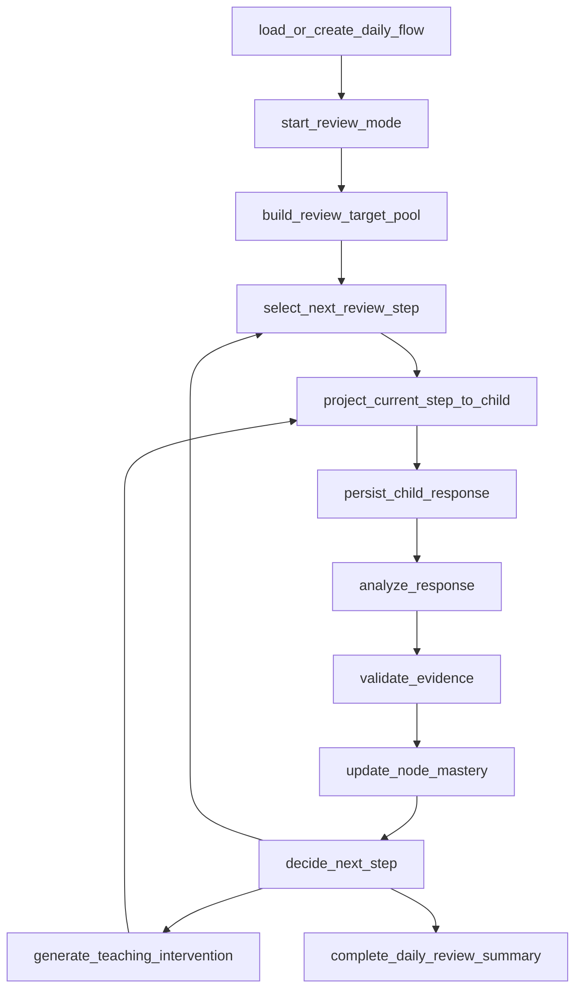

# Daily Learning Runtime Contract v1

Status: draft contract for implementation planning
Owner: 若命
Created: 2026-07-10 CST
Scope: daily adaptive learning flow, starting with old-knowledge review

## 0. Purpose

This contract defines the executable runtime skeleton for the son's daily
learning flow.

The daily runtime is not a fixed question-list engine. It is a step-by-step
state machine:

```text
load daily flow
-> build graph-bound review targets
-> select exactly one current step
-> show child-safe step
-> save response
-> analyze evidence
-> validate evidence
-> update affected graph state
-> decide next step
-> repeat or summarize
```

Only semantic judgment and teaching generation should call agents. Persistence,
state transition, graph lookup, evidence filtering, idempotency, queue recovery,
and child-safe projection are deterministic runtime/service work.

## 1. Node Type Rules

| Type | Owns | Must not do |
|---|---|---|
| `runtime` | state machine, persistence, idempotency, recovery, child projection | invent teaching judgment |
| `service` | deterministic data operations such as graph lookup, bank lookup, filters | override agent/evaluation meaning |
| `agent` | semantic analysis, teaching judgment, planning, explanation generation | directly mutate source state |
| `gate` | schema/evidence/lineage validation and fail-closed decisions | reinterpret weak evidence as mastery |

Every agent output must pass a runtime gate before it can affect child state,
mastery state, next-step selection, or reports.

## 2. Core Runtime Objects

| Object | Meaning | Required fields |
|---|---|---|
| `daily_flow` | One day of child learning | `flow_id`, `date`, `mode`, `status`, `budget_min`, `budget_max`, `current_step_id`, `created_at`, `updated_at` |
| `flow_step` | One visible child step | `step_id`, `flow_id`, `position`, `step_type`, `node_id`, `status`, `selection_reason`, `expected_evidence`, `created_at` |
| `review_target` | Candidate graph node for review | `target_id`, `flow_id`, `node_id`, `priority`, `source_state`, `reason`, `status` |
| `attempt` | Child response evidence | `attempt_id`, `step_id`, `node_id`, `answer_text`, `photo_refs`, `evidence_status`, `grading_status` |
| `answer_analysis` | Agent analysis for one response | `attempt_id`, `agent_run_id`, `comparison`, `process_gap`, `error_tags`, `confidence`, `usable` |
| `mastery_decision` | Evaluation result for affected node(s) | `decision_id`, `node_id`, `source_attempt_ids`, `old_state`, `new_state`, `reason` |
| `next_step_decision` | Planner decision | `decision_id`, `flow_id`, `source_evidence`, `action`, `node_id`, `reason`, `branch_policy` |

## 3. Top-Level Workflow



## 4. Node Contracts

### 4.1 `load_or_create_daily_flow`

Type: `runtime`

Trigger:

- child opens the page
- child refreshes the page
- operator asks to inspect today's state

Inputs:

- child identity, currently single-child implicit identity
- local date
- optional resume token/current step handle

Outputs:

- existing open `daily_flow`, or new `daily_flow`
- current child-safe state: choose mode, continue step, blocked, or summary

Writes:

- creates `daily_flow` if none exists for today
- records recovery audit if a stale flow is resumed

Blocks child?

- No, unless database is unavailable or flow is in a hard blocked state.

Failure handling:

- DB unavailable: show child-safe retry message, log operator-visible error.
- duplicate open flows: runtime chooses the newest valid flow and marks others
  `superseded` or `operator_attention_required`.

Audit evidence:

- `flow_id`, recovery decision, selected current step if any.

Next:

- `start_review_mode` if no mode selected
- `project_current_step_to_child` if resuming a visible step
- `complete_daily_review_summary` if already done

### 4.2 `start_review_mode`

Type: `runtime`

Trigger:

- child chooses "复习旧知识"
- runtime resumes an unfinished review mode

Inputs:

- `daily_flow`
- requested mode: `review_old_knowledge`

Outputs:

- flow mode set to review
- daily review budget, default 10-20 interactions

Writes:

- updates `daily_flow.mode`
- records mode start event

Blocks child?

- No.

Failure handling:

- If mode already active, return idempotently.
- If a current step exists, resume that step instead of rebuilding the world.

Audit evidence:

- mode, budget, timestamp.

Next:

- `build_review_target_pool`

### 4.3 `build_review_target_pool`

Type: `runtime + service`

Trigger:

- review mode starts
- target pool exhausted
- graph/mastery status changed enough to require refresh

Inputs:

- graph nodes and prerequisites
- current `learner_node_status`
- recent valid attempts
- planned new-learning path
- spaced-confirmation policy

Outputs:

- ordered `review_target` pool

Writes:

- creates or refreshes `review_target` rows for this flow

Blocks child?

- Usually no. If graph is unreadable, yes.

Failure handling:

- unknown graph node in status: exclude and log data issue.
- no targets: move to new-knowledge readiness check or daily summary.
- graph version mismatch: mark stale targets and rebuild.

Audit evidence:

- target count by priority
- skipped mastered nodes
- graph version

Target priority:

| Priority | Source | Runtime meaning |
|---|---|---|
| P0 | `D` or repeated `C` | blocked/unpassed, must repair or rollback |
| P1 | prerequisite for next new node | needed before new learning |
| P2 | untested node | cannot rely on it yet |
| P3 | `B/C` recovering node | needs confirmation |
| P4 | new-learning verification | checks after recent teaching |
| P5 | due spaced check | lightweight only |

Next:

- `select_next_review_step`

### 4.4 `select_next_review_step`

Type: `agent + runtime gate`

Agent:

- `planner_agent`

Trigger:

- no current visible step
- prior step was evaluated
- teaching intervention finished
- independent safe step is needed while another evidence item is pending

Inputs:

- target pool
- current valid evidence
- pending evidence summary
- graph prerequisites
- small candidate packet from Question Bank Service, not the full question bank
- daily budget used/remaining
- recent step history and cooldowns

Pre-agent candidate reduction:

`planner_agent` must never receive the whole question bank. Runtime and Question
Bank Service must first reduce candidates deterministically:

```text
graph target
-> active eligible questions for that node/prerequisite path
-> remove stale versions, duplicates, cooldown violations, mastered-node extras
-> group by question_family / variant_signature / evidence_goal
-> keep top small candidate packet with compact metadata
```

Recommended hot-path candidate packet:

- maximum 5-8 candidate questions for the selected target node
- maximum 2 candidate teaching actions
- compact metadata only: `question_id`, `node_id`, `family`,
  `difficulty_vector`, `evidence_goal`, `target_error_tags`,
  `requires_reasoning`, `last_used_at`, `why_candidate`
- no full bank dump
- no long solution banks unless the candidate is selected for display/analysis

Agent output:

- `next_step_decision`
- selected node
- selected action: `question`, `micro_teach`, `interactive_check`,
  `same_structure_retest`, `near_transfer_retest`, `prerequisite_probe`,
  `new_knowledge_entry`, `summary`
- selection reason
- expected evidence
- branch policy for correct/partial/wrong/stuck/answer-only/pending

Runtime gate:

- selected node exists in graph
- selected question, if any, is active eligible
- selected step does not depend on pending evidence unless explicitly waiting
- mastered nodes are skipped unless spaced check is due
- no duplicate/cooldown violation

Writes:

- `next_step_decision`
- `flow_step` with `status=selected`

Blocks child?

- Briefly, yes, because the child needs one current step.
- If planner/model route fails, runtime can use a conservative deterministic
  fallback only for safe actions: resume current step, ask for clarification,
  or choose a P0/P1 already-approved diagnostic question. It must not claim
  mastery or generate new teaching conclusions.

Failure handling:

- invalid planner JSON: retry once through model adapter, then block with
  operator-visible reason or deterministic safe fallback.
- no eligible question for selected node: request `micro_teach` or mark bank gap.
- planner chooses stale/pending evidence: reject decision and log gate failure.
- planner timeout: use deterministic safe fallback if possible, otherwise show
  child-safe short waiting state.

Audit evidence:

- planner agent run
- candidate targets supplied
- selected target
- rejected alternatives/skipped mastered nodes
- gate verdict
- candidate packet size
- model latency and timeout/fallback mode

Next:

- `project_current_step_to_child`
- `generate_teaching_intervention` if the selected action needs teaching content
- `complete_daily_review_summary` if action is `summary`

### 4.5 `project_current_step_to_child`

Type: `runtime`

Trigger:

- a current step is selected or resumed

Inputs:

- `flow_step`
- question prompt or teaching/interactivity package
- child-safe projection rules

Outputs:

- child page payload

Writes:

- marks step `displayed`
- records projection hash/version

Blocks child?

- No.

Failure handling:

- child-safe validation fails: do not display; return safe retry message and
  log the offending fields.
- missing prompt/package: return to `select_next_review_step` or block.

Child payload may include:

- step position
- topic label
- prompt/explanation/interactivity
- answer input mode
- upload affordance
- concise hint if allowed

Child payload must not include:

- graph ids
- raw question ids
- attempt ids
- session/flow ids
- model/provider names
- agent names
- rubrics
- OCR confidence
- internal status machine labels

Audit evidence:

- projection version, sanitized fields, step id.

Next:

- waits for `persist_child_response`

### 4.6 `persist_child_response`

Type: `runtime`

Trigger:

- child submits text answer
- child uploads photo
- child answers an interaction/micro-check

Inputs:

- current step handle/position
- answer text
- optional photo data
- client idempotency key

Outputs:

- persisted attempt or interaction response
- attachment refs
- response receipt for child page

Writes:

- `attempt`
- `attempt_attachment`
- step status `responded`
- background job if analysis is async

Blocks child?

- No for persistence.
- It may block moving to the next dependent step until analysis is available.

Failure handling:

- duplicate submit: return existing receipt.
- empty evidence where evidence is required: ask child to enter answer or upload.
- photo save failure: keep text if present; otherwise ask retry.
- current step mismatch: reject with safe reload instruction.

Audit evidence:

- attempt id, step id, attachment count, idempotency key.

Next:

- `analyze_response`

### 4.7 `analyze_response`

Type: `agent + model router`

Agent:

- `answer_analysis_agent`
- for teaching interactions, a narrower `teaching_check` contract can be served
  by `answer_analysis_agent` or `teaching_agent` through a strict schema.

Trigger:

- attempt/interaction response persisted
- queued review job resumes
- stale pending attempt is recovered

Inputs:

- question or interaction package
- rubric/expected evidence
- answer text
- photo/OCR package if present
- graph node and prerequisite context
- valid solution paths/common wrong paths

Outputs:

- structured `answer_analysis`
- OCR usability if photo was used
- confidence and evidence status recommendation

Writes:

- `agent_run`
- `answer_analysis`
- attempt grading fields only after validation
- background job status

Blocks child?

- It blocks any next step that depends on this evidence.
- It should not block independent safe steps.

Failure handling:

- model route disabled: mark analysis pending/config error; do not grade.
- model schema unsupported: router uses plain JSON adapter.
- malformed output: retry; if still malformed, mark pending/error.
- OCR low confidence: do not infer mastery; request clarification or mark pending.

Audit evidence:

- prompt/schema version
- model route metadata without secrets
- output validation result
- OCR confidence and transcript if any

Next:

- `validate_evidence`

### 4.8 `validate_evidence`

Type: `gate`

Trigger:

- analysis output exists
- recovered job has model output

Inputs:

- attempt
- answer analysis
- graph node
- question version/review record
- evidence status

Outputs:

- `usable_evidence=true/false`
- rejection or pending reason

Writes:

- evidence validation record
- attempt status update: `graded`, `pending_review`, `invalid_analysis`, or
  `operator_attention_required`

Blocks child?

- Only when the next decision depends on this evidence and no independent safe
  step exists.

Hard reject or pending when:

- missing `answer_analysis`
- schema invalid
- graph node unknown
- question is stale or not active eligible
- OCR too uncertain and no written evidence exists
- attempt invalidated
- model output is mock-only but runtime is claiming live evidence
- answer-only cannot satisfy required process evidence

Audit evidence:

- validation verdict
- failed fields
- graph/question version

Next:

- `update_node_mastery` if usable
- `decide_next_step` with pending/clarification path if not usable

### 4.9 `update_node_mastery`

Type: `agent + runtime gate`

Agent:

- `evaluation_agent`

Trigger:

- usable evidence validated

Inputs:

- affected node id
- current node status
- recent usable evidence for the node
- prerequisite chain summary
- current attempt analysis

Agent output:

- mastery decision: `A`, `B`, `C`, or `D`
- dimension scores: concept, model, procedure, calculation, expression,
  transfer
- confidence
- reason
- whether more evidence is needed

Runtime gate:

- one correct answer cannot produce stable `A`
- answer-only cannot produce full mastery
- invalid/pending/stale evidence excluded
- decision only touches affected node(s)

Writes:

- `mastery_decision`
- `learner_node_status` update through runtime only

Blocks child?

- Briefly when the next step depends on the updated state.

Failure handling:

- invalid evaluation output: do not update status; pass usable attempt to
  planner as "analysis available, evaluation pending" only if safe.
- contradiction with hard evidence rules: reject and log.

Audit evidence:

- source attempts
- old/new status
- dimensions
- gate verdict

Next:

- `decide_next_step`

### 4.10 `decide_next_step`

Type: `agent + runtime gate`

Agent:

- `planner_agent`

Trigger:

- mastery state updated
- evidence unusable/pending and a branch decision is needed
- teaching intervention completed
- daily budget reached

Inputs:

- current daily flow state
- latest attempt/evaluation/pending reason
- review target pool
- graph prerequisites
- budget used/remaining
- new-learning readiness

Agent output:

- action:
  - `continue_review`
  - `same_structure_retest`
  - `near_transfer_retest`
  - `prerequisite_probe`
  - `micro_teach`
  - `enter_new_knowledge`
  - `ask_clarification`
  - `daily_summary`
- selected node or teaching target
- reason and branch policy

Runtime gate:

- cannot use pending as mastery evidence
- cannot enter new knowledge if prerequisite chain has active `D`
- cannot drill same type repeatedly without a teaching move or variation reason
- cannot choose mastered node unless spaced confirmation is due

Writes:

- `next_step_decision`
- target status updates such as completed/skipped/pending

Blocks child?

- Briefly, yes, if no safe deterministic path exists.

Failure handling:

- planner fails: deterministic fallback can ask clarification, resume previous
  step, or pick the highest-priority active eligible diagnostic target. It must
  not mark learning progress.

Audit evidence:

- branch chosen
- alternatives skipped
- evidence source
- gate verdict

Next:

- `select_next_review_step`
- `generate_teaching_intervention`
- `complete_daily_review_summary`

### 4.11 `generate_teaching_intervention`

Type: `agent + runtime gate`

Agent:

- `teaching_agent`

Trigger:

- planner action is `micro_teach`, `enter_new_knowledge`, `ask_clarification`
  with teaching support, or repair after wrong/partial/stuck evidence

Inputs:

- teaching target node
- teaching contract from graph
- child's attempt analysis
- process gap
- expected next evidence
- allowed teaching move

Agent output:

- child explanation
- contrast between child thought and better thought, if applicable
- micro-check prompt
- hint ladder
- stop condition

Runtime gate:

- child-safe text only
- no backend labels, agent names, model names, graph ids
- explanation must be short and actionable
- must include observable next evidence

Writes:

- teaching package
- `flow_step` with `step_type=teaching` or `interactive_check`

Blocks child?

- Briefly while generating.
- If generation fails, runtime can show a conservative generic prompt such as
  "先把你的想法写出来" only as clarification, not as substantive teaching.

Failure handling:

- invalid child-safe output: reject and retry once.
- missing graph teaching contract: mark graph/content gap and choose safe review
  step instead.

Audit evidence:

- teaching agent run
- teaching move
- source diagnosis
- child-safe gate verdict

Next:

- `project_current_step_to_child`

### 4.12 `complete_daily_review_summary`

Type: `runtime + optional teaching/report agent`

Trigger:

- review budget satisfied
- old-knowledge high-priority targets cleared enough to enter new learning
- child chooses to stop
- runtime reaches safe stopping condition

Inputs:

- today's steps
- usable and pending evidence
- mastery decisions
- planner decisions
- unresolved blockers

Outputs:

- child-safe daily summary
- Codex/operator report facts
- next recommended mode: continue review, learn new knowledge, stop today

Writes:

- daily summary artifact/row
- flow status `completed`, `paused`, or `ready_for_new_knowledge`

Blocks child?

- No. It is an end or transition state.

Failure handling:

- report generation fails: preserve DB facts and show minimal summary.
- pending evidence remains: label it pending; do not overstate.

Child summary includes:

- what was confirmed today
- what needs more practice
- what the next step is
- any pending review note in child-safe language

Operator/Codex report includes:

- graph nodes touched
- attempts and evidence status
- mastery changes
- pending/model/OCR issues
- next-step rationale

Audit evidence:

- summary version
- source step ids
- source mastery decisions
- pending labels

Next:

- stop
- or begin new-knowledge learning flow if runtime and planner agree

## 5. Agent Calls In This Runtime

| Node | Agent | Hot path? | Notes |
|---|---|---|---|
| `select_next_review_step` | `planner_agent` | yes | chooses one current step, not a full fixed list |
| `analyze_response` | `answer_analysis_agent` | yes | can be async; blocks only dependent next steps |
| `update_node_mastery` | `evaluation_agent` | yes | writes status only through runtime gate |
| `decide_next_step` | `planner_agent` | yes | chooses continue/reteach/rollback/new/summary |
| `generate_teaching_intervention` | `teaching_agent` | conditional | only when teaching or clarification is needed |
| question generation | `question_designer_agent` + `question_reviewer_agent` | no | should be async bank maintenance, not per-step hot path |

## 6. Blocking Policy

The child should not wait for internal work unless the next visible step depends
on that work.

| Situation | Runtime behavior |
|---|---|
| text answer, model fast | analyze, evaluate, choose next step |
| model slow, independent safe target exists | move to independent step without using pending answer |
| model slow, no independent safe target | show short child-safe waiting/retry state |
| OCR unclear | ask for clearer photo or written explanation |
| model config missing | mark operator-visible config error; do not pretend grading is slow |
| evidence invalid | do not update mastery; ask clarification or choose safe step |

## 7. Hot-Path Model Interaction Budget

The runtime must treat model calls as expensive and fallible. It should not make
the child wait while a model reads large context or performs work that can be
done by deterministic services.

### 7.1 Context Budget

| Agent call | Hot path? | Context allowed |
|---|---|---|
| `planner_agent.select_next_review_step` | yes | latest evidence summary, target node summary, 5-8 candidate metadata rows, pending summary, budget state |
| `answer_analysis_agent.analyze_response` | yes | one question/interactivity package, one child response, rubric, valid solution paths, OCR package if any |
| `evaluation_agent.update_node_mastery` | yes | affected node, recent usable evidence for that node, current analysis, prerequisite summary |
| `teaching_agent.generate_teaching_intervention` | conditional | one diagnosis, one graph teaching contract, one allowed teaching move |
| `question_designer_agent` / `question_reviewer_agent` | no | async maintenance context, never required for immediate next child step |

Forbidden hot-path context:

- entire question bank
- entire graph JSON
- all historical attempts
- all node statuses
- long daily reports
- raw uploads unless needed for OCR/answer analysis

Services should pass compact summaries and ids. If an agent needs more detail,
runtime should fetch only the selected item after the model selects from the
small candidate packet.

### 7.2 Latency Budget

Target latency should be measured and recorded. Initial budgets:

| Call | Target | Hard handling |
|---|---|---|
| planner next-step | 2-4s | timeout -> deterministic safe fallback or short wait |
| answer analysis text-only | 3-8s | async if slow; dependent next step waits |
| answer analysis with photo/OCR | 8-20s | child-safe wait or independent step |
| evaluation | 2-5s | retry/fallback to provisional no-status-change |
| teaching intervention | 3-8s | retry once; fallback to clarification, not fake teaching |

Every model call should record:

- agent key
- prompt/schema version
- candidate/context size
- provider/model route
- latency
- timeout/retry/fallback mode
- validation verdict

### 7.3 Caching And Deterministic Prework

Runtime/services should cache or precompute:

- active eligible question candidates per node
- candidate diversity groups
- graph prerequisite summaries
- recent usable evidence summaries per node
- spaced-confirmation due list
- bank gap list

The model should judge among already-filtered choices, not perform database
search.

## 8. Implementation Implications

The first implementation slice should create these structures before adding more
teaching intelligence:

- `daily_flow` and `flow_step` state tables or compatible rows
- current-step child projection API
- review target pool builder
- planner decision contract
- evidence validation gate
- per-step idempotency keys
- summary artifact tied to source steps

Do not start by expanding prompts. Start by making the runtime impossible to
confuse with a fixed question-list batch processor.
