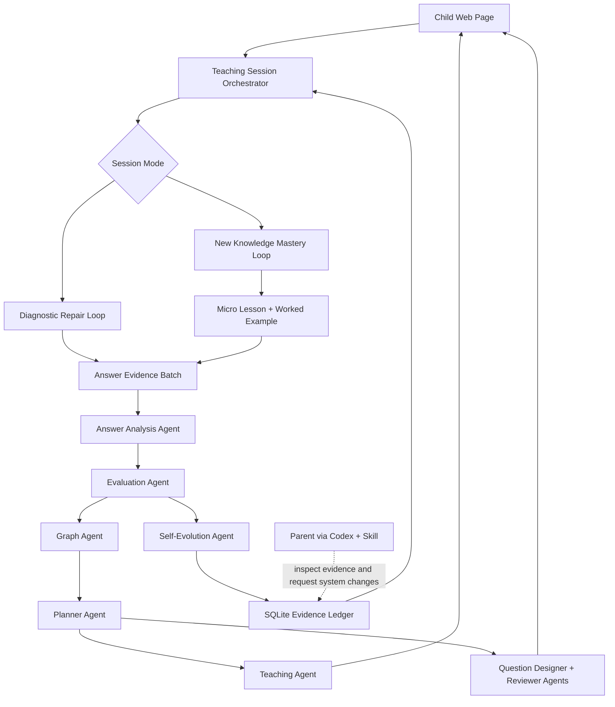
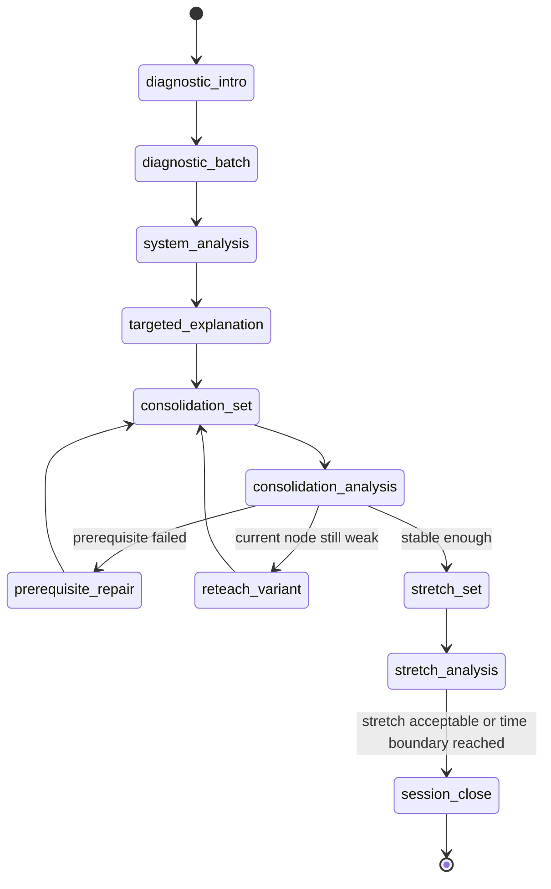
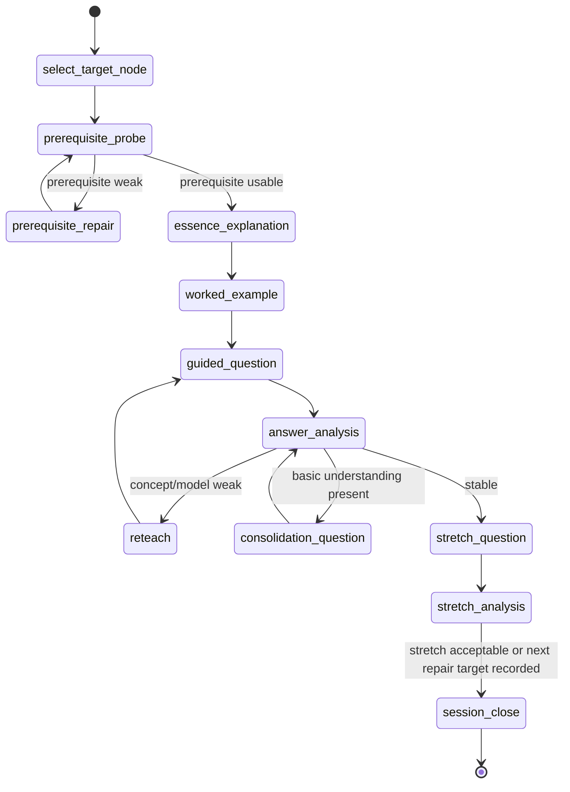

# Child-Only Teaching Session Architecture Design

Date: 2026-07-05
Status: spec-reviewed
Scope: local single-child math learning system, next architecture iteration

## Objective

Redesign the local learning system around one child-facing experience and one automatic internal teaching loop.

The child uses only the web page. The parent uses Codex to inspect progress and improve the system, but there is no parent web dashboard, no manual parent grading flow, and no child-visible agent, graph, or self-evolution UI.

The system must support two real learning scenes:

1. Diagnostic repair: the child completes a batch of high-signal questions; the system analyzes answers and reasoning, identifies weak knowledge points, explains, gives consolidation questions, gives stretch questions, and closes the round.
2. New knowledge mastery: the child learns one new graph node or a small node cluster; the system teaches, asks questions, evaluates, reteaches or repairs prerequisites, and repeats until the node is understood enough to move on.

Companion contract:

- Internal model-backed agents, prompt envelopes, schemas, audit fields, and authority boundaries are defined in `docs/design/specs/2026-07-05-internal-agent-model-prompt-contract-design.md`.
- This architecture owns the learning loop; the prompt contract owns how each internal agent talks to models and what validated outputs may enter the loop.

## Non-Goals

- No multi-user account system.
- No parent-facing web console.
- No child-visible graph editor, agent console, Codex panel, or self-evolution page.
- No raw drill generator that produces low-age arithmetic or unit-conversion questions as the main path.
- No private textbook, workbook, or commercial question-bank import unless the user explicitly provides source material.
- No fixed calendar plan that ignores real evidence.
- No implementation in this spec. Implementation planning starts only after this spec is reviewed.

## Architecture Summary

The next version should be organized as a teaching-session state machine. The current backend already has graph nodes, question items, attempts, answer analysis, evolution events, and generated plans. The redesign changes the center of gravity from "pick a few tasks" to "run a complete teaching round."

## Primary User Surface

The child page has one job: carry the current learning session.

It should show:

- the current round type in child language, such as "先做一组判断题" or "今天学有理数的正负";
- one explanation or one question at a time;
- a written-answer box;
- optional photo upload for paper work;
- a simple saved/submitted/analyzing/next-step state;
- feedback written to the child, including what was understood, what was missing, and the next action.

It should not show:

- parent reports;
- manual review forms;
- "copy to Codex";
- agent names;
- graph coverage;
- self-evolution status;
- internal error tags.

## Session Modes

### Diagnostic Repair Loop

Purpose: use a small batch of high-quality questions to locate real gaps, then repair and verify.

Stop conditions:

- close as mastered when the child shows correct answer, valid reasoning, and enough transfer evidence for the target node;
- close as repaired but not mastered when basic understanding improves but transfer remains weak;
- close as prerequisite-blocked when repeated evidence points to an earlier node that must be repaired before continuing;
- close by time boundary only after preserving the exact next internal action.

### New Knowledge Mastery Loop

Purpose: teach a new graph node with model-first explanation and evidence-based practice.

The lesson must follow the project teaching order:

1. essence explanation;
2. core model;
3. standard example;
4. variant;
5. check;
6. error-cause rollback.

## Internal Agent Roles

Agents are internal system roles. They may be deterministic code, model calls, or hybrid steps. The child never sees these roles.

| Agent | Input | Output | Contract |
|---|---|---|---|
| Teaching Session Orchestrator | session state, plan, attempts, agent outputs | next child-facing step | Owns the state machine and prevents parent/manual intervention from becoming part of the learning loop. |
| Graph Agent | graph, target node, attempts, error evidence | prerequisite path, affected nodes, graph repair notes | Every teaching action and question must bind to graph nodes. Seven-grade failures first inspect prerequisite chains. |
| Question Designer Agent | node, learning objective, error evidence, required evidence type | candidate question | Generates age-appropriate, graph-bound questions with visible reasoning evidence requirements. |
| Question Reviewer Agent | candidate question, quality rules, child age floor | approved/rejected item with reasons | Blocks low-level drills, answer-only prompts, meta wording, vague rubrics, and questions that cannot reveal reasoning. |
| Answer Analysis Agent | question, rubric, reference solution, child text/photo | structured answer analysis | Judges final answer and reasoning. Correct answer with wrong, missing, circular, or lucky reasoning is at most partial. |
| Evaluation Agent | structured answer analyses, node history | node status and mastery judgment | Distinguishes concept, model, calculation, reading, expression, checking, and transfer gaps. |
| Teaching Agent | evaluation result, graph node teaching contract | child-facing explanation and prompt | Produces concise explanations and hints targeted to the observed gap. |
| Planner Agent | session result, graph status, due retests | next state and next question/lesson target | Chooses repair, consolidation, stretch, or next node. It does not mechanically follow a calendar. |
| Self-Evolution Agent | processed analyzed evidence, rejected candidates, outcomes | revised rules, evolved questions, audit events | Evolves only from real processed evidence. It must not fabricate progress to satisfy tests. |

## Agent Handoff Contract

Every internal handoff should use structured evidence, not free-form notes alone.

Core fields:

- `session_id`
- `session_mode`: `diagnostic_repair` or `new_knowledge_mastery`
- `phase`
- `target_node_ids`
- `question_ids`
- `attempt_ids`
- `answer_analysis`
- `error_dimensions`
- `rollback_candidates`
- `mastery_decision`
- `next_action`
- `child_message`
- `audit_reason`

`answer_analysis` must include:

- optimal final answer;
- recommended solution path;
- alternate valid approaches if applicable;
- child answer summary;
- comparison by dimension;
- process gap;
- explanation for the child;
- recommended next prompt.

Allowed `phase` values:

- `select_target_node`
- `diagnostic_intro`
- `diagnostic_batch`
- `system_analysis`
- `targeted_explanation`
- `prerequisite_probe`
- `prerequisite_repair`
- `essence_explanation`
- `worked_example`
- `guided_question`
- `answer_analysis`
- `reteach`
- `consolidation_question`
- `consolidation_set`
- `consolidation_analysis`
- `reteach_variant`
- `stretch_question`
- `stretch_set`
- `stretch_analysis`
- `session_close`
- `analysis_pending`
- `paused`

Allowed `next_action` values:

- `show_explanation`
- `ask_question`
- `analyze_batch`
- `request_clearer_evidence`
- `repair_prerequisite`
- `reteach_current_node`
- `give_consolidation`
- `give_stretch`
- `close_mastered`
- `close_repaired`
- `close_prerequisite_blocked`
- `pause_pending_analysis`
- `resume_saved_step`

Allowed `mastery_decision` values:

- `not_enough_evidence`: the system cannot judge yet;
- `pending_analysis`: submissions are saved but not analyzed;
- `prerequisite_blocked`: an earlier node must be repaired first;
- `current_node_weak`: the target node needs reteaching or more consolidation;
- `basic_understanding`: the child can handle standard use but transfer is not stable;
- `stable_understanding`: the child has answer, reasoning, and variant evidence;
- `stretch_ready`: the child can attempt a higher-transfer or combined question;
- `mastered_for_now`: the session can close and the node can be marked mastered for the current learning horizon.

Allowed `closure_result` values for `teaching_sessions`:

- `mastered`: the target node can be marked mastered for now;
- `repaired_not_mastered`: a prior weakness improved, but transfer or stretch evidence is not yet strong enough;
- `prerequisite_blocked`: a prerequisite node must be repaired before the target can continue;
- `pending_analysis`: the session has saved submissions but cannot close because analysis is incomplete;
- `paused_time_boundary`: the child stopped at a time boundary and the exact resume action is stored;
- `invalidated`: the session evidence was excluded by maintenance because it was corrupted or mistaken.

## Question Design Rules

The bank should be small but strong. A question enters active scheduling only if it has a clear diagnostic or teaching purpose.

Required question families:

- diagnostic discriminator: exposes a likely misconception or missing model;
- standard model check: verifies whether the child can apply the intended model;
- variant: changes representation or numbers without changing the core idea;
- error diagnosis: asks the child to find and repair a wrong solution;
- transfer/application: requires modeling from language, units, or context;
- stretch: combines ideas or asks for explanation/generalization.

Age floor:

- Do not schedule isolated low-age arithmetic such as simple integer division, plain unit conversion, or decimal multiplication as a main task.
- If calculation stability must be tested, embed it in estimation, error diagnosis, expression transformation, equation setup, units, checking, or transfer.
- The question must require visible process evidence. A final answer alone is insufficient.

## Data Model Changes

The current SQLite ledger remains the right base. The architecture needs a stronger session layer on top of the existing tables.

Add or evolve these concepts:

- `teaching_sessions`: one complete child learning round, with mode, target nodes, state, phase, and closure result;
- `session_steps`: ordered child-facing steps, such as explanation, question, feedback, consolidation, stretch;
- `agent_handoffs`: structured internal outputs for audit and replay;
- `mastery_decisions`: node-level decision records produced at session boundaries;
- `question_review_records`: durable quality gate results for generated and evolved questions;
- `evolution_audits`: evidence-driven changes to agent profiles, question rules, or graph notes.

Existing `attempts.answer_analysis_json` remains the source of truth for judging answers. Existing `learner_node_status` remains the current node state summary, but it should be updated only by a valid session-close decision.

`learner_node_status` update rule:

- Do not update node mastery from raw submissions, pending attempts, low-confidence analysis, or a single mid-session step.
- During an open session, step-level evidence can be stored in `session_steps`, `attempts`, and `agent_handoffs`, but it remains provisional.
- Node mastery can be updated only by the Teaching Session Orchestrator during an atomic `session_close` operation, after all required attempts for the closing decision have valid structured `answer_analysis`.
- The only exception is invalidation or safety maintenance: Codex/API maintenance can mark evidence invalid, but this removes evidence from future decisions instead of granting mastery.

## Child-Facing Flow Rules

- The child should not be interrupted after every answer by a parent-review state.
- A batch can be submitted and analyzed together.
- If AI analysis is pending, the UI should say the system is analyzing and preserve progress.
- If the model is unavailable, the session cannot honestly claim mastery; it should save work and show a calm "analysis pending" state.
- Feedback should be specific but not humiliating.
- The system can ask the child to explain, compare methods, correct an error, or upload written work.

## Error Handling

Model unavailable:

- Save submission as pending.
- Do not update mastery.
- Do not evolve agents.
- Show child that analysis will continue when the system is ready.

Low-confidence answer analysis:

- Keep attempt pending or request another evidence step.
- Do not treat answer-only correctness as mastery.

Photo unreadable:

- Ask the child to type the key steps or upload a clearer photo.
- Preserve the uploaded file as non-mastering evidence.

Question quality failure:

- Reject the item.
- Record the reviewer reason.
- Ask the planner for another item or fall back to a pre-approved bank item.

Repeated failure:

- Stop pushing same-level variants.
- Ask Graph Agent for prerequisite rollback.
- Close the session as prerequisite-blocked if needed, with a clear next repair target.

Time boundary:

- Close or pause the session without losing state.
- Store the next internal action so the next login resumes cleanly.

## Codex/Skill Boundary

Parent interaction stays in Codex.

Codex should be able to ask the system:

- what the child did;
- what the system concluded;
- what evidence supports the conclusion;
- which graph nodes changed state;
- why the next round is repair, consolidation, stretch, or new learning;
- whether any agent rule evolved from real evidence;
- whether the system itself needs redesign.

This is not a parent UI. It is a local API/skill inspection surface for Codex and future maintenance.

Codex-side grading and repair APIs are maintenance-only:

- They can backfill legacy evidence, invalidate mistaken evidence, inspect pending work, or rerun internal processing.
- They are not part of the normal child learning loop.
- They must not require the parent to grade, approve, copy, paste, or manually move a child session forward.
- If a model/API key is missing, Codex can help configure the system, but the product state remains `pending_analysis` until system analysis runs.

## Verification Plan

Automated tests should cover:

- creating a diagnostic repair session;
- completing a batch and preventing per-question parent blocking;
- AI-first answer analysis requiring reasoning, not only final answer;
- correct answer with invalid reasoning becoming partial;
- weak evidence causing prerequisite rollback;
- stable evidence causing consolidation then stretch;
- session closure updating node state only after valid structured analysis;
- model-unavailable path saving pending evidence without mastery updates;
- question reviewer rejecting low-age drills and answer-only prompts;
- self-evolution from real weak evidence changing a future generated question or rule;
- child UI containing no parent dashboard, Codex copy workflow, graph coverage, or agent console.

Manual checks should cover:

- real mobile photo upload;
- visual clarity on child page;
- whether explanations feel respectful to the child;
- whether the first real session feels like a guided learning round rather than a test admin tool.

## Implementation Boundary For Next Plan

The next implementation plan should focus on one vertical slice:

1. introduce teaching-session state and APIs;
2. adapt the child page to session phases;
3. make answer analysis and evaluation drive the next phase;
4. enforce question designer/reviewer gates in active scheduling;
5. add a real self-evolution test from processed weak evidence;
6. remove or hide any remaining parent-dashboard assumptions from the child UI.

This is enough to make the architecture real without trying to solve every future subject or long-term analytics feature at once.
