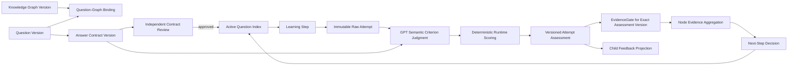

# Answer Assessment and Storage Boundary Design

Date: 2026-07-14
Status: spec-reviewed-awaiting-user-approval
Scope: single-child AI math learning runtime, per-question assessment, feedback, mastery evidence, and storage boundaries

## Objective

Define a stable and lightweight contract for judging every child answer, showing useful feedback immediately after each question, updating mastery evidence, and selecting the next runtime action. When that action is another question, it must not repeat the same mathematical core as false transfer.

The design must preserve five product requirements:

1. Every completed question returns a score, reference answer, answer gap, and concrete improvement direction.
2. Mathematical intent takes priority over wording, capitalization, sentence completeness, or other nonessential presentation details.
3. Scoring follows prevalidated question-specific criteria instead of model preference at grading time.
4. A question score describes one attempt; mastery is a separate evidence aggregation decision.
5. Knowledge graph data, questions, answer contracts, raw attempts, assessments, mastery state, and reports remain separate storage domains.

## Approved Product Decisions

- Child-visible scoring uses a 10-point scale.
- The system uses a hybrid assessment model: preloaded reference solution and score points, GPT semantic judgment, and deterministic runtime score calculation.
- A correct mathematical answer is not penalized for optional verbosity or formatting.
- Ordinary questions do not require the child to circle the easiest-to-miss step. Reflection requirements appear only when reflection or error analysis is the actual assessment target.
- The operational store remains one local SQLite database, with normalized domain boundaries and versioned references.
- Knowledge graph, knowledge content, question content, answer contracts, learning records, raw responses, assessments, and mastery state must not be collapsed into one object or overwritten by each other.

## Authority and Compatibility

This design is the authoritative amendment for per-question answer contracts, scoring, assessment storage, and child feedback. Where it conflicts with `docs/architecture/engineering_contract_v5.md`, the following clauses are superseded for this feature:

- an accepted `attempt_assessment` becomes the scoring authority; score and analysis columns on `attempts` become compatibility projections only;
- `EvidenceGate` validates an exact accepted assessment version in addition to the immutable attempt and model run;
- the normal text-answer hot path uses one semantic GPT call for criterion judgment; deterministic runtime reducers compute the score, mastery evidence, and next action;
- additive schema changes are allowed only for the two new source tables and the minimum lineage columns/indexes defined in this document.

All other v5 contracts remain in force, including durable jobs, idempotency, trust labels, child-safe projection, graph rollback, bounded candidate packets, retry/recovery, and report lineage.

Before production code changes, the implementation plan must publish an `ENGINEERING_CONTRACT v5.1` amendment containing these exact supersessions. This is a documentation gate, not an unresolved product decision.

### Authoritative Hot Path

For a normal live text answer, the call chain is exact:

1. submission transaction writes one immutable attempt and enqueues one `answer_analysis` background job;
2. that job performs the single GPT semantic criterion judgment;
3. after schema validation, persist the accepted answer-analysis envelope/result references before reducer replay; one idempotent reducer transaction then writes the accepted assessment, compatibility projection, exact-assessment evidence validation, mastery decision, next-step decision, and one materialized child state;
4. deterministic evaluation/planner `agent_runs` may be recorded for lineage, but no `evaluation_update`, `planner_decision`, or `teaching_generation` background job is enqueued on this live hot path;
5. any immediate repair explanation comes from the accepted answer-analysis output plus prevalidated graph teaching content and is materialized by runtime.

Photo answers may require one separate Doubao OCR call before the single GPT semantic judgment. OCR remains untrusted evidence.

Legacy `evaluation_update`, `planner_decision`, and `teaching_generation` durable job handlers remain compatibility/replay paths for recorded fixtures, unfinished pre-v5.1 jobs, and controlled recovery only. They may not create a second accepted assessment or duplicate mastery/next-step output when the v5.1 answer-analysis result already contains valid result references. New v5.1 answer-assessment hot paths never enqueue them; unrelated new-knowledge teaching flows remain governed by their own contract.

The `answer_analysis` idempotency result contains all downstream authoritative ids. Restart/retry reuses those ids or resumes the incomplete reducer transaction without another semantic call.

### Authority Matrix

| Component | May decide | May not decide |
|---|---|---|
| Question/contract review | Reference solution, atomic score points, pass-required points, graph dimensions, activation | Child score or mastery |
| GPT answer judge | Semantic status of each named score point, grounded gap explanation, expression equivalence | Point values, total score, mastery, next action |
| Runtime scorer | Validate exact criterion set and calculate total from stored points | Reinterpret child mathematics |
| EvidenceGate | Whether the exact assessment version is trusted and usable | Change score or infer mastery |
| Mastery reducer | Aggregate validated criterion evidence by graph dimension | Regrade the answer |
| Next-step reducer | Select teaching, clarification, question, readiness, blocked, or summary from validated evidence | Change the assessment |
| Reports/projections | Present accepted records | Create or mutate evidence |

## Non-Goals

- Do not enumerate every possible equivalent child expression in advance.
- Do not use exact string matching as the primary free-response grading method.
- Do not make the model invent score weights during each assessment.
- Do not infer durable mastery from one high-scoring direct question.
- Do not split the local runtime across multiple database files unless a future operational need justifies the consistency cost.
- Do not expose internal criteria, graph ids, contract ids, model metadata, or trust labels on the child page.

## Current Failure Being Corrected

The live flow graded this response to a number-line question as partial:

```text
a,c,b
c=a+3=0.5
```

The response contains the correct movement relation, value, and ordering. It was downgraded because it did not expand every substitution step or circle an error-prone step. The runtime then selected another item with the same values and mathematical core under a different question-type label.

Under this design the response scores 10/10. The omitted presentation details are not scoring targets, and a subsequent question may not reuse the same core structure as a supposed transfer question.

## Assessment Architecture



The model has one narrow responsibility at runtime: decide whether the child evidence satisfies each preloaded score point and explain the semantic gap. The runtime owns point arithmetic, evidence application, mastery aggregation, and next-step policy.

## Lightweight Answer Contract

Every active question has one versioned answer contract. The contract has only two required semantic objects:

```json
{
  "reference_solution": {
    "answer": "C=0.5, A<C<B",
    "key_relation": "C=A+3"
  },
  "score_points": [
    {
      "key": "right_means_add_three",
      "criterion": "Recognizes that moving three units right means adding 3",
      "points": 3,
      "dimension": "model_relation",
      "required_for_pass": true
    },
    {
      "key": "value_of_c",
      "criterion": "Obtains C=0.5",
      "points": 4,
      "dimension": "calculation",
      "required_for_pass": true
    },
    {
      "key": "ascending_order",
      "criterion": "Orders the points as A<C<B",
      "points": 3,
      "dimension": "representation",
      "required_for_pass": true
    }
  ]
}
```

Contract rules:

- Score points total 10.
- A normal question should contain two to four atomic score points.
- Every score point has a unique stable `key`, a positive integer point value, one graph-valid `dimension`, and `required_for_pass` which defaults to `true`.
- Every contract has at least one `required_for_pass` criterion; a contract with none cannot activate.
- Each score point names observable mathematical evidence, not a preferred sentence form.
- `dimension` connects the criterion to mastery evidence without maintaining a separate mapping object.
- `reference_solution` is concise. It is a trusted comparison basis, not a required wording template.
- Alternative methods are optional contract notes only when method constraints are mathematically important. GPT recognizes ordinary valid alternatives semantically.
- Global expression policy defines non-scoring presentation details once; they are not repeated in each contract.
- Common misconceptions and prerequisite chains are inherited from the bound graph node. Only question-specific exceptions require item-level tags.
- The structure fingerprint is generated and validated by the question pipeline; it is not manually authored inside the contract.
- If a criterion could be partly correct in a meaningful way, the authoring pipeline splits it into smaller atomic score points. Runtime grading has no generic half-credit rule.

## Contract Creation and Activation

The question-design pipeline produces the question and its answer contract together. The question-review pipeline independently solves the question and checks:

- the reference answer is mathematically correct;
- the score points measure the stated question goal;
- all score points can be observed from a reasonable child response;
- the total is 10;
- score-point keys are unique and dimensions are valid for the bound graph version;
- each point is atomic enough for a binary semantic judgment;
- optional writing preferences have not been turned into hidden scoring requirements;
- the prompt, reference solution, and score points do not contradict each other;
- the structure fingerprint and transfer label describe the real mathematical core.

A question cannot become active unless its immutable `question_items.id + item_version`, active `question_review_records` row, and approved answer-contract version are all valid in one activation transaction.

Activation semantics:

- `answer_contracts` has a stable contract id and an immutable contract version/digest;
- exactly one approved active contract may exist for one immutable question version;
- the active question review record references the active contract id/version/digest;
- `flow_steps` captures that exact contract reference when the step is selected;
- ordinary retirement affects only future selection; an already-selected step continues with its captured contract;
- correctness quarantine supersedes an unsubmitted selected step with a safe replacement;
- if correctness quarantine occurs after submission, the attempt is preserved, no mastery is applied, and maintenance may issue an explicit regrade against a corrected contract.

## Runtime Semantic Judgment

GPT receives a bounded packet:

- immutable question version;
- approved answer-contract version;
- child text, attachment references, and explicitly untrusted OCR evidence with provenance/confidence;
- response mode;
- no full question bank and no unrelated learner history.

The canonical assessment input digest includes:

- question id/item version and prompt digest;
- answer-contract id/version/digest;
- original attempt id/version/evidence digest;
- ordered clarification attempt ids and evidence digests, if any;
- attachment and OCR artifact digests with provenance/confidence;
- answer-judge prompt/schema version;
- expression-equivalence policy version;
- score-calculation policy version;
- EvidenceGate policy version.

GPT returns criterion judgments rather than a freely invented total score:

```json
{
  "criteria": [
    {
      "criterion_key": "right_means_add_three",
      "status": "met",
      "child_evidence": "c=a+3",
      "reason": "Semantically states that moving right by 3 adds 3."
    },
    {
      "criterion_key": "value_of_c",
      "status": "met",
      "child_evidence": "0.5",
      "reason": "Matches the correct value of C."
    },
    {
      "criterion_key": "ascending_order",
      "status": "met",
      "child_evidence": "a,c,b",
      "reason": "Unambiguously expresses A<C<B in ascending order."
    }
  ],
  "answer_gap": "No mathematical gap affecting this question's score.",
  "improvement_direction": "No required repair. A fully written solution may include the substitution C=-2.5+3=0.5.",
  "expression_judgment": "The sequence a,c,b unambiguously expresses the same ascending order as A<C<B.",
  "confidence": 0.97
}
```

Allowed criterion statuses are:

- `met`: the mathematical intent satisfies the criterion;
- `not_met`: the required evidence is absent or wrong;
- `contradicted`: the response explicitly conflicts with the criterion;
- `unclear`: the available text/photo evidence cannot support a safe judgment.

The model must cite child evidence for every `met` judgment. The runtime accepts output only when:

- every contract criterion key appears exactly once;
- no unknown or duplicate key appears;
- every status is allowed;
- every `met` judgment contains grounded child evidence;
- the response schema and question/contract/attempt lineage match exactly;
- confidence is at or above the configured answer-judgment threshold;
- no unresolved text/photo contradiction remains.
- `answer_gap`, `improvement_direction`, and `expression_judgment` are present and grounded in the same criterion evidence.

Failure of any condition produces no finalized assessment and no score. It follows normal retry, clarification, or blocked behavior.

## Deterministic Scoring

The runtime calculates the visible score from approved contract points:

- `met`: full criterion points;
- `not_met` or `contradicted`: zero criterion points;
- `unclear`: the assessment is not finalized and no score is applied until clarification or safe retry.

Scores are normalized to one decimal place on a 10-point scale. The model does not emit or override the total.

Question-specific score points control what matters. There is no universal penalty for missing prose, omitted routine arithmetic, capitalization, ordering notation, or sentence completeness. If explanation is the target, explanation appears as a score point. If it is not a score point, it does not reduce the score.

A mathematically correct final answer produced with explicitly contradictory reasoning receives only the atomic points supported by valid evidence. It cannot become qualified reasoning evidence merely because the final value matches.

An assessment is `question_passed` only when every `required_for_pass` criterion is `met`. The numerical total is child feedback; pass qualification is criterion based. This prevents a high-value final-answer point from masking a missing required model or proof.

## Expression Equivalence Policy

The semantic judge accepts different wording or notation when intent is unambiguous. Examples include:

- `a,c,b` as an ascending sequence is equivalent to `A<C<B` when the prompt asks for ordering;
- `往右三个格所以加3` is equivalent to `C=A+3`;
- an alternative valid method is accepted even when it differs from the reference path;
- skipped routine arithmetic is acceptable when the required relation and result are both clear.

Expression affects scoring only when:

- the notation is genuinely ambiguous;
- the response contains a logical contradiction;
- a required relation cannot be inferred safely;
- units, signs, or symbols are part of the mathematical target and are wrong;
- explanation or proof is an explicit score point.

## Per-Question Child Feedback

After every finalized assessment, the child sees exactly these content sections:

1. `本题得分`: the deterministic score out of 10.
2. `标准答案`: the concise reference answer and only the necessary steps.
3. `和标准答案之间的差距`: matched evidence, valid alternatives, missing evidence, and incorrect evidence.
4. `改进方向`: at most one or two concrete next actions.
5. `表达判定`: a short statement confirming equivalent intent or identifying a real ambiguity that affected judgment.

The feedback must not show criterion ids, graph dimensions, mastery codes, provider names, prompt versions, model confidence, queue state, or internal error tags.

Feedback is followed by the one runtime-selected child action. It may be continue to a question, read teaching, clarify evidence, start new knowledge, finish summary, retry, or safely stop. The UI must not imply that the next state is always another question.

Submission and completion semantics:

- `submitted_pending`: raw answer saved, analysis not finalized; no score yet;
- `clarification_required`: evidence is unclear or conflicting; original attempt remains open through a linked clarification step;
- `finalized_scored`: every criterion is safely judged; the five feedback sections are shown;
- `support_requested`: explicit stuck/"I don't know" is an unscored help request, not a graded mathematical answer;
- `cannot_provide`: the step closes unscored with no mastery update when the child cannot supply usable evidence;
- blank input is not accepted as a completed answer;
- `blocked`: infrastructure/model failure preserves the attempt without fabricating a score.

Thus every safely finalized answer receives a score; not every submission is falsely treated as a completed answer.

### Clarification Identity

A clarification is stored as a new immutable supporting attempt linked to `clarifies_attempt_id`, which points to the original scored-attempt candidate.

- The supporting clarification attempt is labeled `supporting_only` and is never scored or counted as a separate mastery attempt.
- Reanalysis creates a new assessment version for the original attempt.
- The new assessment digest includes the original evidence plus the ordered linked clarification evidence.
- The prior pending/rejected assessment remains auditable; if a prior accepted assessment is being corrected, normal regrade/supersession rules apply.
- EvidenceGate and mastery consume only the latest accepted assessment for the original attempt, preventing double counting.
- Duplicate clarification submission reuses the same supporting attempt through its flow-step/idempotency key.

## Attempt Score Versus Mastery

An attempt score answers: "How well did this response satisfy this question?"

Mastery answers: "What does the accumulated independent evidence support about this graph node?"

The mastery reducer consumes criterion-level evidence, not only the visible total. It records which dimensions were demonstrated, the transfer level, evidence independence, trust label, and recency.

Rules:

- A 10/10 direct question is strong evidence for the dimensions tested by that question, not automatic durable mastery.
- Evidence cannot support a dimension the question did not test.
- A correct answer with unsupported or contradicted reasoning cannot prove reasoning mastery.
- Repeated questions with the same core structure do not count as independent transfer evidence.
- Stable mastery requires evidence across the graph node's required roles, such as direct application and a genuinely different transfer or representation.
- Low-confidence photo/OCR evidence cannot update mastery until clarified.
- `evidence_validations` must reference the exact accepted assessment id/version/digest as well as the attempt and answer-analysis run.
- Contract dimensions are activation-validated against the exact graph version captured by the flow step.

## Next-Question Selection and Duplicate Prevention

The active question index stores generated structural metadata separately from child evidence:

- `prompt_instance_fingerprint`;
- `core_structure_fingerprint`;
- `problem_family`;
- `evidence_role`;
- `transfer_level`;
- graph-node bindings;
- difficulty and interaction type.

After a `question_passed` response, the selector excludes:

- the same question version;
- the same core structure fingerprint within the active lesson unless an explicit repair policy allows it;
- cosmetic rewrites that reuse the same values, relation, and requested conclusion;
- candidates mislabeled as transfer when they do not change the mathematical structure.

If another item is needed on the same node, it must collect missing evidence through a different structure, representation, context, or transfer demand. Otherwise the runtime advances to another due, untested, weak, or newly unlocked graph node.

A same-structure exception is allowed only when all conditions hold:

- the previous child action was a `teaching_repair` or worked example;
- the explicit next action is `same_structure_confirmation`, never transfer;
- the surface values/context differ and the exact prior prompt is excluded;
- at most one consecutive same-structure confirmation is allowed;
- the confirmation cannot count as independent transfer evidence;
- failure after that confirmation moves to teaching, clarification, or prerequisite probing rather than a third same-structure item.

Fingerprint authority is canonical and versioned:

1. New/active questions must have reviewer-approved `prompt_instance_fingerprint` and `core_structure_fingerprint` generated under the current fingerprint-policy version.
2. `prompt_instance_fingerprint` normalizes the actual mathematical data, relations, unknowns, and requested conclusions while removing instructional wrappers. It blocks cosmetic rewrites of the same problem.
3. `core_structure_fingerprint` abstracts replaceable values/context while preserving the mathematical relation and evidence demand. It controls same-structure confirmation and transfer claims.
4. Existing `core_stem_id`, semantic-stem signature, and problem-family metadata are migration inputs and advisory filters, not final authority. They cannot override canonical fingerprints.
5. Legacy active items are deterministically backfilled from reviewed core problem fields and independently checked during contract activation. Missing or conflicting fingerprints make the item ineligible until reviewed; runtime does not guess.

## Storage Boundaries

The operational SQLite database uses separate logical domains. One database provides atomic submission and recovery; table and module boundaries provide decoupling. This design reuses existing v5 tables and requires only two new source tables.

### Knowledge Graph Domain

- `graph_nodes`
- `graph_edges`
- existing graph-version ledger/meta identity

Owns node identity, prerequisites, unlocks, stage, and graph metadata. It does not own questions, answers, learner attempts, or mastery decisions.

### Question Domain

- `question_items`
- `question_review_records`
- existing versioned metadata in `question_items.raw_json/source_json`

Owns child-facing question content, `item_version`, interaction type, difficulty, provenance, node binding, activation status, and structural selection metadata. Existing `core_stem_id`, semantic-stem signature, and problem-family metadata are reused before any new index table is considered. It does not own learner scores.

### Answer Contract Domain

- `answer_contracts` (new)
- active `question_review_records` link to the approved contract

Owns versioned reference solutions, score points, validation status, and review lineage. A contract references one immutable question version.

The compact `reference_solution` and `score_points` may remain JSON columns inside `answer_contracts`; decoupling does not require over-normalizing two to four criteria into separate tables.

### Learning Flow Domain

- `learning_sessions`
- `daily_flows`
- `flow_steps`
- `next_step_decisions`

Owns session sequence, current step, selected question version, selected contract version, and selection evidence. It does not own raw answer content or assessment output.

### Attempt Domain

- `attempts`
- `attempt_attachments`

Owns the immutable child submission: text, structured interaction response, photo references, response mode, idempotency key, and timestamps. It does not own score, correctness, mastery state, or rewritten answers.

### Assessment Domain

- `attempt_assessments` (new)
- `evidence_validations`
- `agent_runs`

Owns criterion judgments, computed score, answer gap, improvement direction, expression judgment, trust state, exact question/contract versions, model/prompt lineage, and assessment version.

Assessment states are `pending`, `accepted`, `rejected`, and `superseded`. Exactly one accepted current assessment may exist per active attempt version. Regrading creates a new row and supersedes the old accepted row only in one reconciliation transaction; it never overwrites the raw attempt.

### Mastery Domain

- `mastery_decisions`
- `learner_node_status`

Owns evidence aggregation and the current graph-node learning state. Every applied decision references accepted assessment and validation ids. It does not copy or mutate raw child responses.

### Reporting Domain

- `daily_summaries`
- generated Codex-readable evidence reports

Reports are derived snapshots. They do not become new evidence and cannot update attempts or mastery state in reverse.

### Mandatory Additive Schema Scope

The implementation may add only:

- `answer_contracts`;
- `attempt_assessments`;
- contract reference columns on `question_review_records` and `flow_steps` if existing JSON fields cannot provide enforceable lineage;
- assessment reference/version/digest columns on `evidence_validations`;
- one enforceable clarification linkage/status field on `attempts` if existing flow-step lineage cannot represent `clarifies_attempt_id` and `supporting_only` safely;
- uniqueness and lookup indexes required for activation, idempotency, and one-current-assessment rules.

It reuses `question_items`, `question_review_records`, `flow_steps`, `attempts`, `agent_runs`, `evidence_validations`, `mastery_decisions`, `learner_node_status`, `next_step_decisions`, and `daily_summaries`. The logical domain lists do not authorize a broad physical schema rewrite.

## Version and Lineage Rules

Every learning step records:

- `graph_version`;
- `question_id` and `question_version`;
- `answer_contract_id` and `answer_contract_version`;
- selection-decision id.

Every attempt references the immutable learning step. Every assessment references the attempt and the exact answer-contract version used. Every mastery update references accepted assessment and evidence-validation ids.

Changing a question or contract creates a new version. Historical attempts remain reproducible. A deliberate historical regrade creates a new assessment with explicit old and new contract lineage.

Regrade policy:

- only explicit maintenance through Codex/system administration or a correctness quarantine may authorize regrading;
- the new assessment records the superseded assessment id and reason;
- all mastery decisions and reports derived from the old assessment become stale by lineage, not deleted;
- a reconciliation transaction creates a new evidence validation and, if usable, a new mastery decision;
- child and Codex projections use the latest accepted assessment and label corrected history honestly;
- while reconciliation has no current accepted assessment, the child projection shows honest pending/correcting status and no score; it never falls back to the superseded score as current;
- automatic background retries reuse the same assessment version/idempotency key and are not regrades.

After a regrade supersedes accepted evidence, learner state is recomputed rather than incrementally patched:

- mark validations, mastery decisions, dependent next-step decisions, and summaries derived from the old assessment stale by lineage;
- deterministically rebuild `learner_node_status` from all currently accepted, non-stale validations for the affected node and graph version in evidence-time order;
- recompute readiness and any open-flow decision that depended on the stale learner state;
- supersede an unconsumed current step selected from stale evidence and materialize one replacement action;
- do not rewrite already completed historical child steps; corrected reports identify the revised evidence and state.

## Failure Handling

- Missing or unapproved contract: do not serve the question.
- Contract/question contradiction detected at runtime: quarantine the item, preserve the attempt, do not update mastery, and select a safe replacement after child-safe messaging.
- Model output malformed or ungrounded: retry within budget; if still invalid, preserve the attempt and request clarification or mark analysis blocked.
- Low-confidence text/photo interpretation: no final score and no mastery update until clarification.
- OCR output is always untrusted extracted evidence, never a trusted answer. The answer judge receives OCR text with confidence/provenance labels; EvidenceGate decides whether the resulting exact assessment is usable.
- Text/photo conflict, suspected OCR hallucination, or unreadable working produces `clarification_required`; clarification rows link immutably to the original attempt and assessment lineage.
- Repeated unclear clarification reaches `cannot_provide` or a safe unscored close instead of false mastery.
- Duplicate submission: reuse the existing immutable attempt and accepted assessment through idempotency keys.
- Service restart: resume pending assessment from stored ids and versions without duplicating model calls or assessments.

## Migration Direction

The current `attempts` table contains raw response fields together with score and analysis projections. Migration must be additive and evidence-preserving:

1. Publish the `ENGINEERING_CONTRACT v5.1` authority amendment defined above.
2. Add versioned answer-contract storage and bind active question versions.
3. Add `attempt_assessments` and make accepted rows the only scoring authority.
4. Write legacy attempt score/analysis columns only as derived compatibility projections in the same transaction as accepted assessment finalization; they are never read to create a new authoritative assessment.
5. Migrate consumers one by one to accepted assessment rows, with read-path assertions detecting stale projection mismatches.
6. Do not fabricate criterion-level historical assessments. A maintenance command authorized through Codex may create a migration receipt only when exact question/version/contract lineage exists; otherwise legacy attempt score fields remain a read-only `legacy_unmigrated` report projection and are never mastery-eligible under v5.1.
7. Update EvidenceGate, reports, and mastery reducers to reference accepted assessment versions.
8. Stop writing compatibility projections only after all consumers and tests use the new authority and all pre-v5.1 flows/jobs are terminal; physical column removal is out of scope.

No existing learning record is deleted or silently reinterpreted during migration.

Historical migration rules:

- authorized actor: explicit Codex/system-maintenance command with dry-run and receipt;
- eligible for true re-assessment: exact immutable question version, approved contract version, complete raw child evidence, and valid model/gate route are available;
- ordinary backfill never synthesizes criterion statuses from an old total score or prose review;
- records without accepted v5.1 assessments remain readable in reports as `legacy_unmigrated`, with their old trust label and no new mastery authority;
- active/open evidence needing v5.1 authority uses explicit re-assessment, not silent backfill.

## Acceptance Criteria

- The number-line response `a,c,b / c=a+3=0.5` receives 10/10 under the approved contract.
- Omitted optional substitution prose and missing circle annotations do not reduce ordinary-question scores.
- Equivalent valid wording and methods receive the appropriate criterion points.
- Correct final answer with explicitly wrong reasoning does not receive unsupported reasoning points or reasoning mastery evidence.
- Every finalized answer displays score, reference answer, semantic gap, one or two improvement directions, and an expression-equivalence judgment.
- Every visible score can be recomputed deterministically from an approved contract and stored criterion judgments.
- Raw attempts never change when an assessment is retried or corrected.
- Contract updates do not alter historical assessments without an explicit regrade record.
- A passing response cannot be followed by a cosmetic rewrite with the same core structure presented as transfer.
- Mastery updates reference accepted assessments and cannot be driven by pending, unclear, stale, mock, or untrusted evidence.
- Child APIs and DOM do not expose contract, graph, assessment, model, provider, prompt, queue, or trust internals.
- Restart and duplicate-submit tests produce one raw attempt and one accepted assessment version for the same idempotent action.
- Text/photo conflict, OCR hallucination, unreadable photo, repeated clarification, stuck, blank, and cannot-provide paths never fabricate a finalized score or mastery update.
- Exactly one criterion judgment is required for every contract key; missing, duplicate, unknown, or unclear criteria cannot produce a score.
- A same-structure confirmation is bounded to one post-teaching use and never counts as transfer evidence.

## Implementation Phases and Gates

### Phase 0: Contract Authority

- Publish `ENGINEERING_CONTRACT v5.1` with the authority matrix and permitted additive schema.
- Gate: no code changes until old and new authorities are unambiguous.

### Phase 1: Contract and Assessment Storage

- Add `answer_contracts`, `attempt_assessments`, minimal lineage columns/indexes, activation validation, and compatibility projection rules.
- Populate and independently validate contracts for active questions before serving them.
- Gate: raw attempts remain immutable; the regression answer recomputes to 10/10; duplicate/restart writes are idempotent.

### Phase 2: Runtime Judgment and Child Feedback

- Change the single GPT answer-analysis call to criterion-key judgments.
- Validate the exact criterion set, calculate score deterministically, run EvidenceGate against the accepted assessment, and render the five feedback sections plus the runtime-selected next action.
- Gate: semantic oracle, photo/clarification/stuck paths, child-safe scan, and mastery lineage pass.

### Phase 3: Selection Independence

- Generate and enforce canonical fingerprint pairs; use existing core-stem/problem-family metadata only as migration inputs and advisory filters.
- Gate: the live number-line regression cannot select the same mathematical core as transfer; legitimate one-step repair confirmation remains available.

### Phase 4: Atomic Activation

- Verify every active selectable question has an approved contract and canonical fingerprint pair.
- Verify all scoring consumers read accepted assessments, EvidenceGate/mastery use exact assessment lineage, reports label legacy fallback, and duplicate-core selection gates are active.
- Activate v5.1 assessment policy atomically for new flows through one policy version/feature flag.
- Existing open flows do not mix policies: a flow with pending legacy analysis safely completes/closes under legacy lineage; a flow with no pending attempt may supersede its unsubmitted current step and restart under v5.1.
- Gate: end-to-end browser, restart, duplicate submit, photo/clarification, regrade reconciliation, report freshness, mastery rebuild, and number-line regression all pass before activation.

## Implementation Boundary

This document defines product and architecture behavior only. Implementation begins after spec review and a separate implementation plan. The implementation plan must preserve the five phase gates above and must not redesign unrelated graph or lesson behavior.
