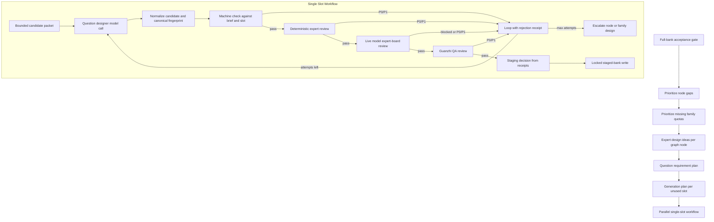

# Question Generation Workflow Code Map - 2026-07-24

Status: `IMPLEMENTED_AS_STAGED_PIPELINE_NEEDS_FULL_BANK_COMPLETION`

Scope: Codex-admin question-bank production for v18/v18.1. This is the management-side workflow only. It does not activate questions for the child runtime.

## Bottom Line

The current pipeline is no longer a loose prompt chain. It is a staged workflow:

- experts design node-bound question requirements;
- the question designer model generates one candidate for one requirement slot;
- machine, deterministic expert, live model expert-board, and Guanzhi QA gates all have receipts;
- staged writes are serialized and receipt-bound;
- full-bank activation still fails until budget, family coverage, and legacy receipt gaps are repaired.

The latest full-bank gate still reports `NEEDS_FIX`: 380 staged candidates, 56/56 nodes covered, but family and budget gaps remain. Staged does not mean active.

## Current Production Flow

## Code Mapping

| Step | Code | Current Contract |
|---|---|---|
| Full-bank gate | `learning_system/admin/full_bank_acceptance.py::build_full_bank_acceptance` | Counts staged items, node budgets, family gaps, duplicate fingerprints, answer contracts, and receipt integrity. |
| Gap prioritization | `scripts/admin_full_bank_production_runner.py::_gap_node_records` | Zero/min gaps first, then family gaps, then target-only gaps; deferred nodes are deprioritized only inside same stage. |
| Family quota selection | `scripts/admin_full_bank_production_runner.py::_select_unstaged_generation_plans` | Selects unused requirement slots, prioritizes missing families, and does not overfill a family beyond its current missing quota before trying the next family. |
| Expert type design | `learning_system/admin/expert_ideation.py::build_expert_design_ideas` | Creates graph-bound family design suggestions and ordered requirement slots. |
| Requirement gate | `learning_system/admin/production_loop.py::build_question_requirement_plan` | Blocks missing node binding, missing slot ids, unknown family, family outside blueprint, and missing design kernels. |
| Bounded candidate packet | `learning_system/admin/production_loop.py::build_generation_plan` | Gives the model only the target node, selected family, slot requirement, compact suggestions, fingerprints, and reject policy. |
| Candidate generation | `learning_system/admin/question_generation.py::build_generated_candidate_from_plan` | Uses live model route with wall-clock deadline and slim JSON fallback; output is normalized by program-assigned id/lineage. |
| Machine check | `learning_system/admin/production_loop.py::validate_candidate_against_brief` | Checks schema, lineage, slot binding, evidence alignment, 10-point scoring, fingerprint, and deterministic review rules. |
| Deterministic expert review | `learning_system/admin/expert_review.py::build_candidate_expert_review` | Expert-profile rule gate for graph binding, child surface, answer contract, source boundary, and grade floor. |
| Model expert board | `learning_system/admin/expert_review.py::build_candidate_model_expert_board_review` | Live model semantic review; status, route, prompt meta, confidence, profile reviews, and findings are written as receipt. |
| Guanzhi QA | `learning_system/admin/qa_review.py::build_candidate_qa_review` | Child-surface and scoring-surface QA gate. |
| Staging decision | `learning_system/admin/production_loop.py::decide_staging_from_receipts` | Requires machine, deterministic expert, model expert, and QA receipts to match the same candidate identity and sha. |
| Locked staged write | `learning_system/admin/staging.py::build_and_write_stage_candidate_receipt` | Uses process and file locks, rejects duplicate ids/fingerprints, and embeds `quality.review_evidence.review_logic` plus receipt summaries. |
| Parallel execution | `learning_system/admin/production_workflow.py::run_batch_production_workflow` | Runs multiple single-slot workflows concurrently; staged writes remain serialized. |

## Evidence Stored On Each Staged Item

Each staged item keeps review and staging evidence under `quality`:

- `quality.staging_receipts`: candidate sha, machine/expert/model/QA report sha values, staging decision path.
- `quality.review_evidence.review_logic`: deterministic expert profiles, model expert-board requirements, Guanzhi QA requirements, staging requirements.
- `quality.review_evidence.receipts`: summary for machine check, deterministic expert review, live model expert-board review, and Guanzhi QA.

This means a later Codex query can explain why a question entered staged bank and which gates approved it.

## Current Failure State

Latest inspected full-bank report:

- `data/admin/full_bank/FULL-BANK-2e950611c366.json`
- status: `NEEDS_FIX`
- staged candidates: 380
- graph nodes covered: 56/56
- family gaps: 157
- budget gaps: 36
- P1 findings: 268

Top blockers:

- `node_family_coverage_gap`: production has not filled planned family coverage.
- `node_below_min_candidate_budget` / `node_below_target_candidate_budget`: several nodes are below budget.
- legacy receipt sha mismatches: early staged items must be regenerated or restaged through the current receipt path.

## Runtime Policy

- Default generation mode should be parallel single-slot workflows, not one large multi-question prompt.
- Multi-question prompt generation remains available for controlled low-risk expansion, but is not the preferred quality path.
- Live model timeout or route failure must surface as `BLOCKED_MODEL_ERROR` or `BLOCKED_MODEL_NOT_CONFIGURED`; it must not be reported as a successful QA pass.
- The staged bank must not be activated until full-bank acceptance, browser/runtime gates, and activation manifest all pass.

## Next Production Direction

1. Continue producing only from full-bank gap records.
2. Prefer nodes/families with missing minimum budget and missing family coverage.
3. Use concurrent single-slot workflows with serialized staged writes.
4. Regenerate or restage legacy items whose receipts do not bind to the current candidate sha.
5. Keep full-bank gate as the only activation source of truth.
